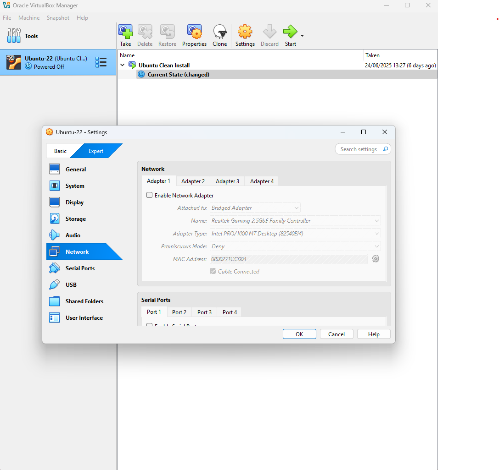
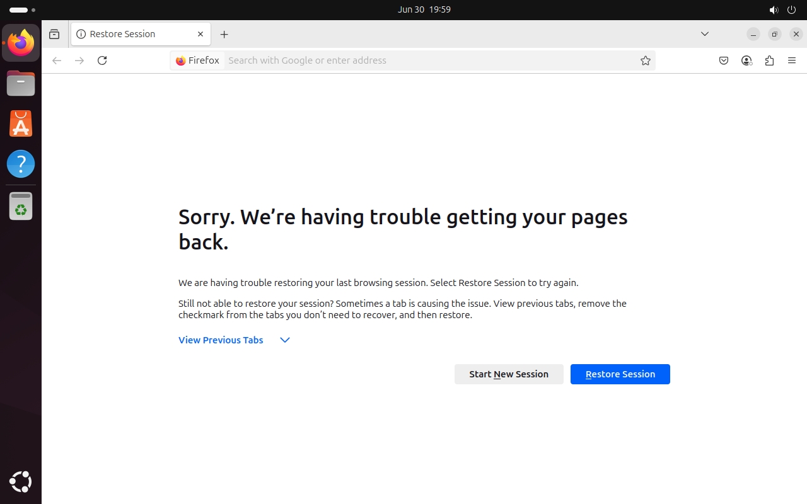
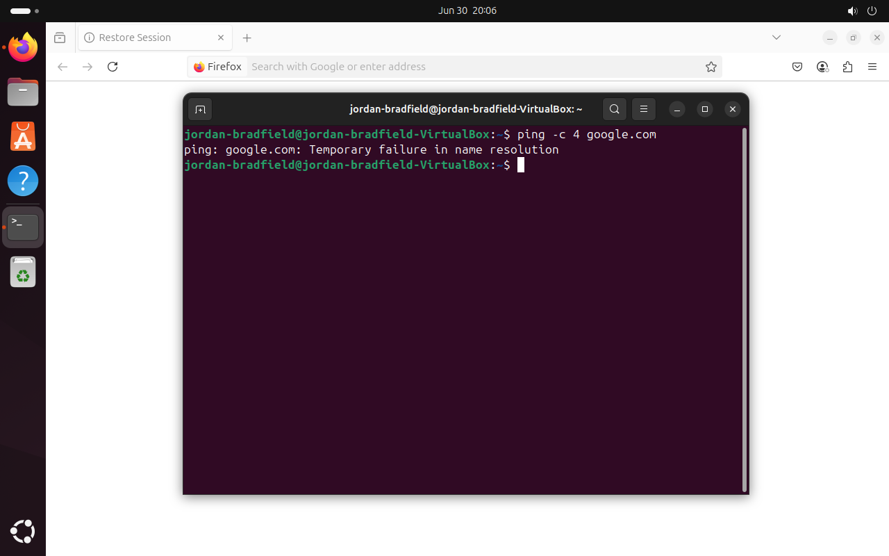
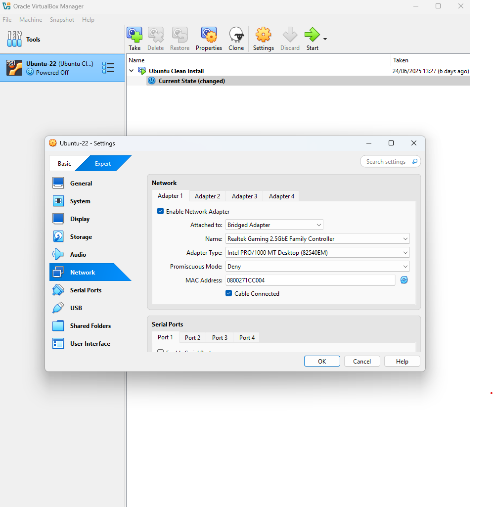
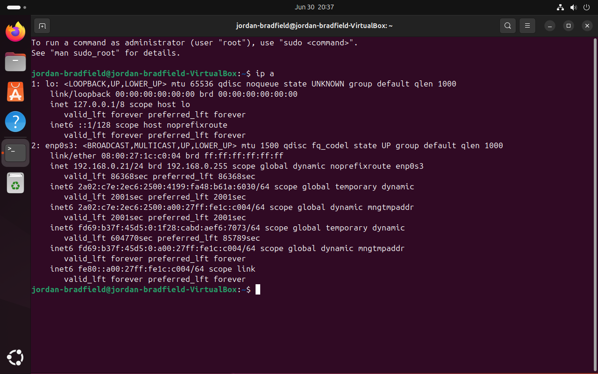
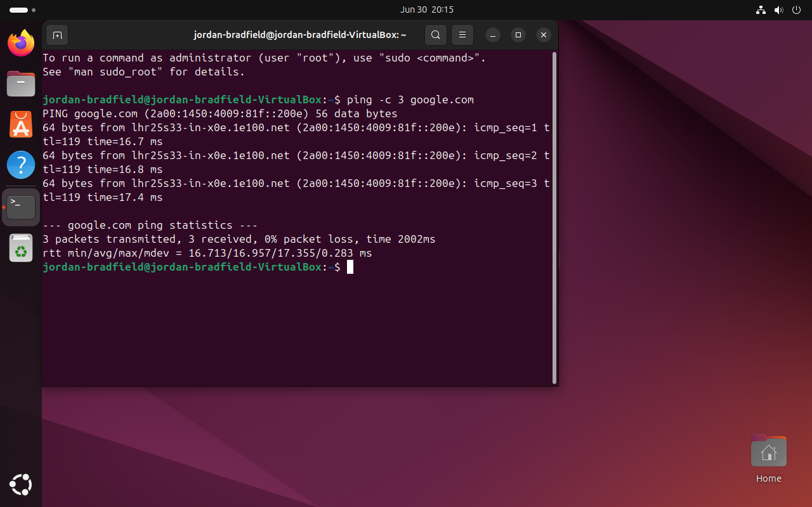

# Notes – Ticket 01: Network Adapter Failure

## Issue Overview

This issue simulated a **common real-world problem**: a VM not connecting to the internet due to a disabled network adapter. It reinforced the importance of verifying *both* the guest OS and host virtualization platform when troubleshooting connectivity.

---

## Environment

- **Virtualization Tool**: VirtualBox 7.1.6  
- **Guest OS**: Ubuntu 22.04 LTS  
- **Host OS**: Windows 11 (24H2)  
- **VM Network Mode**: Bridged Adapter  
- **Account Used**: `jordan-bradfield` (non-root)

---

## Symptoms Observed

- Missing network icon in Ubuntu GUI  
- `ping google.com` returned: `Temporary failure in name resolution`  
- No IP assigned to the interface (`ip a` showed only loopback)  

These symptoms clearly suggested **no active network interface** on the VM.

---

## Key Diagnostic Commands and Their Purpose

### 1. Check IP address:  
```bash
ip a
```

- **What it does:** Shows all network interfaces and their IP addresses on the system.  
- **Why I ran it:** To check if the VM had an active network interface with a valid IP address. Seeing only the loopback interface means no network was assigned.

### 2. Test DNS resolution and connectivity:  
```bash
ping google.com
```

- **What it does:** Sends ICMP echo requests (“pings”) to `google.com` to test network connectivity and DNS resolution.  
- **Why I ran it:** To verify if the VM can reach external hosts and resolve domain names. The failure indicated either no network or broken DNS.

---

## Root Cause

VirtualBox **Adapter 1** was disabled in VM settings. Since the guest OS couldn’t detect a physical NIC, it couldn’t obtain an IP address or connect to the internet.

---

## Fix Applied

1. **Powered off** the Ubuntu VM.  
2. Opened VirtualBox → **Settings → Network**  
3. Enabled **Adapter 1**.  
4. Set the attached mode to **Bridged Adapter**.  
5. Selected the correct host NIC (Ethernet).  
6. Booted VM and tested connectivity again.

---

## Verifying the Fix

### 1. Check IP after fix:  
```bash
ip a
```

- The output now shows a valid IP address (e.g., `192.168.x.x`) assigned to the VM’s network interface (`enp0s3`). This confirms the VM is connected to the network.

### 2. Confirm internet connectivity:  
```bash
ping google.com
```

- Successful ping responses confirm the VM can resolve domain names and communicate with external servers.

---

## Additional Troubleshooting Tips

- If bridged mode does not work as expected, try switching the VM network adapter to **NAT** mode temporarily to check if that restores connectivity.  
- Verify that the **host network adapter** is active and connected, as bridged mode relies on this.  
- Check **VirtualBox host-only network** and firewall settings on the host machine, which can sometimes block or restrict VM network traffic.

---

## Potential Pitfalls and Warnings

- Always **power off the VM** before changing VirtualBox network settings to avoid configuration errors or crashes.  
- Bridged networking requires the host NIC to be **physically connected and active**; otherwise, the VM won’t get an IP address.  
- Some **firewall or antivirus software** on the host can block VM network traffic, temporarily disable them if you suspect this.

---

## Broader Application of This Issue

Although this issue occurred in VirtualBox, the principle of checking **virtualization layer settings** applies to other hypervisors like VMware and Hyper-V. Likewise, physical machines may encounter similar issues if network adapters are disabled or misconfigured.

---

## Key Takeaways

> **Always check the virtualization layer and host network adapters first when a VM has connectivity issues.**  
>  
> Using simple commands like `ip a` and `ping` methodically helps quickly pinpoint network problems.  
>  
> Documenting troubleshooting steps clearly makes it easier to reproduce and resolve similar issues in the future.

---

## Screenshot References

| Description                        | Image Path                                |  
|------------------------------------|--------------------------------------------|  
| Disabled adapter in VirtualBox     |      |  
| Ubuntu with no connection          |     |  
| Ping failure                       |          |  
| Enabled adapter in VirtualBox      |       |  
| Successful DHCP IP assignment      |          |  
| Ping success (after fix)           |          |

---

## Final Thoughts

This was a small but realistic scenario — a disabled network adapter is easy to overlook. It helped reinforce a key principle:  
> **Always check the virtualization layer when network problems arise in a VM.**

Using simple commands like `ip a` and `ping` in a logical order helped quickly pinpoint the issue. Documenting the process ensures I can easily repeat the troubleshooting if needed.

---
