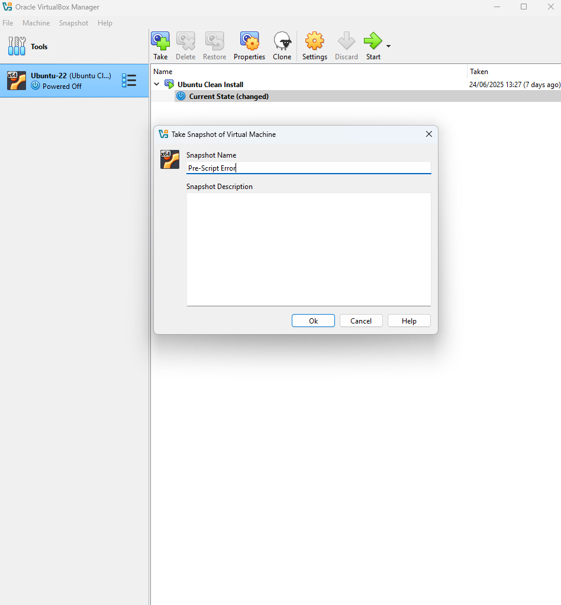

# Notes – Ticket 02: Snapshot Recovery

## Issue Overview

This ticket simulated a **critical post-update failure** in a virtualized Ubuntu system. After applying updates and configuration changes, the VM became unstable and sometimes failed to boot, presenting GRUB and pre-startup script errors. Resolving this involved a **VirtualBox snapshot recovery**, a practical skill that’s essential in real-world IT to quickly return systems to a known good state.

> Personally, this one reminded me how unpredictable VMs can be when snapshots aren’t managed carefully. It was a good lesson in planning and verification.

---

## Environment

- **Virtualization Tool:** VirtualBox 7.1.6  
- **Guest OS:** Ubuntu 22.04 LTS  
- **Host OS:** Windows 11 (24H2)  
- **Snapshot Name:** "Ubuntu Clean Install"  
- **Snapshot Created:** 29-06-2025

---

## Observed Symptoms

- Initial boot failure with **GRUB errors**, system could not load desktop environment.  
- Later boots showed GUI but displayed a **pre-startup script warning**.  
- Terminal access was possible, but system behavior remained unpredictable.  
- Root cause traced to changes applied *after* the snapshot was taken.

> This highlighted a key point: inconsistent behavior can mask the real underlying issue, so logs and snapshots are your best friends.

---

## Key Concepts & Practical Takeaways

### GRUB (GRand Unified Bootloader)
- **Purpose:** Loads the OS kernel and hands control to it.  
- **Failure Indicators:** Errors here usually mean the system can’t complete boot, often due to corrupted filesystems, broken startup services, or kernel issues.  
- **Practical Tip:** When GRUB errors appear, check boot order, disk integrity, and logs before making major changes.

---

### Emergency Mode (Linux)
- **Triggered When:** Critical boot processes fail (e.g., missing mounts, broken dependencies).  
- **Behavior:** Drops you into a minimal shell; GUI doesn’t start.  
- **What I Did:** Checked logs with `journalctl -xb` and verified filesystem integrity; if needed, restore from snapshot or reinstall broken packages.

> Seeing emergency mode firsthand reinforced why system logs are non-negotiable in troubleshooting.

---

## Snapshot Recovery Process (Hands-On)

1. Powered off the VM.  
2. Opened VirtualBox → **Snapshots** tab.  
3. Selected "Ubuntu Clean Install" and clicked **Restore**, confirming the action.  
4. VM rebooted; emergency mode appeared, confirming snapshot timing captured the problem state.

> Key insight: snapshots are only valuable if **taken at the right time**, preferably before risky updates.

---

## Diagnostic Commands & Why They Matter

### 1. View IP configuration
    ip a
- Confirms network interfaces and DHCP-assigned IPs.  
- Loopback-only output (`127.0.0.1`) means no network connectivity.  
- Personal note: Even though it’s simple, this is always the first thing I check after restoring a VM, saves so much guessing.

---

### 2. Test Internet connectivity
    ping google.com
- Confirms DNS resolution and outbound traffic.  
- If it fails: investigate networking, firewall, or DNS issues.  
- Personal tip: a quick ping often tells me whether the VM is fundamentally healthy before diving into logs.

---

### 3. Review boot logs
    sudo less /var/log/boot.log
- Displays detailed startup logs.  
- Look for `[FAILED]` or service-specific errors (e.g., `network-manager`, `gdm`).  
- Personal insight: logs are rarely exciting to read, but they usually **reveal the root cause faster than trial-and-error**.

---

## Screenshot References

| Description                        | Image Path                                    |
|------------------------------------|-----------------------------------------------|
| Snapshot before issue              |             |
| GRUB boot failure                  |             |
| Pre-script warning during boot     |            |
| Snapshot list before restore       |     |
| Restore confirmation dialog        |    |
| Boot log with failure indicators   |       |
| Ping success after restore         |  |
| IP assignment success              |          |

---

## Personal Reflections & Lessons Learned

- Always **take snapshots before making major changes** — this one reinforced the value of planning.  
- Logs (`boot.log`, `journalctl`) are your most reliable tools; GUIs can be misleading.  
- Basic commands (`ping`, `ip a`) remain crucial for confirming system and network health.  
- Snapshot recovery isn’t just a safety net, it’s **part of proactive disaster recovery and virtualization best practice**.

> Overall, this ticket strengthened my hands-on troubleshooting skills and gave me confidence handling unstable virtual environments, exactly the kind of practical experience employers look for.
