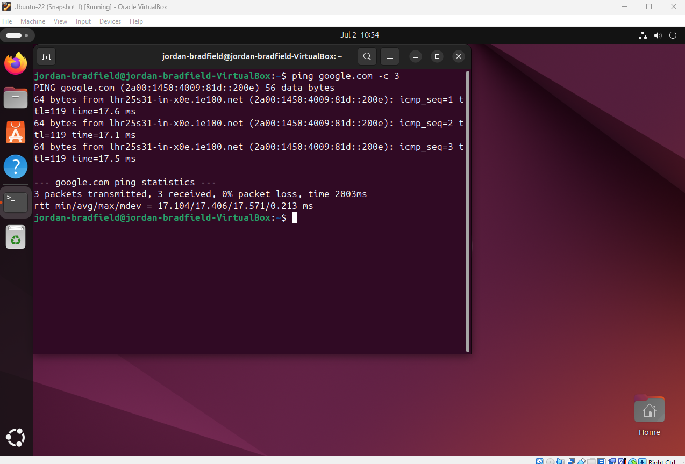

# Notes – Ticket 02: Snapshot Recovery

## Issue Overview

This ticket recreated a **critical post-update failure** in a virtualized Ubuntu system. After applying updates and configuration changes, the VM became unstable, sometimes failing to boot entirely with GRUB errors or dropping into emergency mode. Recovery required rolling back via a **VirtualBox snapshot**, a core skill for minimising downtime and restoring functionality.

> Reflection: A straightforward fix on the surface, but it reinforced how fragile virtual environments can become if snapshots aren’t managed carefully. Planning matters as much as troubleshooting.

---

## Environment

- **Virtualization Tool:** VirtualBox 7.1.6  
- **Guest OS:** Ubuntu 22.04 LTS  
- **Host OS:** Windows 11 (24H2)  
- **Snapshot Name:** "Ubuntu Clean Install"  
- **Snapshot Created:** 29-06-2025  

---

## Observed Symptoms

- Initial boot failure with **GRUB errors**, preventing the OS from loading.  
- Intermittent boots where GUI appeared but with **pre-startup script warnings**.  
- Emergency mode triggered, leaving only shell access.  
- Ultimately traced to snapshot timing captured after unstable updates were already in place.  

> Key takeaway: inconsistent boot behavior can hide the real issue. Logs don’t lie they tell the full story.

---

## Key Concepts

### GRUB (GRand Unified Bootloader)
- **Purpose:** Loads the Linux kernel at startup.  
- **Failure Indicators:** Errors usually signal a broken boot sequence (filesystem corruption, kernel mismatch, or failed services).  

### Emergency Mode
- **Triggered When:** Critical startup units or mounts fail.  
- **Behavior:** Drops system into a minimal shell with limited functionality.  
- **Practical Use:** Best place to review logs, confirm disk status, and decide whether to repair or restore.  

---

## Snapshot Recovery Process (Hands-On)

1. Powered off the VM.  
2. Opened VirtualBox → **Snapshots** tab.  
3. Selected "Ubuntu Clean Install" and clicked **Restore**, confirming the rollback.  
4. Rebooted VM; system still showed degraded state, confirming snapshot had preserved problems.  
5. Continued diagnostics (logs, service checks) to validate snapshot timing issue.  

> Insight: Snapshots are only as useful as *when* you take them. A poor snapshot strategy can lock in failure.

---

## Diagnostic Commands & Why They Matter

### 1. View IP configuration
```
ip a
```
- Confirms whether NICs are active and IPs are assigned.  
- Output limited to loopback = no usable connectivity.  

### 2. Test Internet connectivity
```
ping google.com
```
- Checks DNS resolution and outbound traffic.  
- Quick health check after restore, if this fails, something deeper is wrong.  

### 3. Review boot logs
```
sudo less /var/log/boot.log
```
- Identifies `[FAILED]` services at startup.  
- Pinpoints exact stage of boot failure.  

### 4. Extended system logs
```
journalctl -xb
```
- Provides full system boot journal with timestamps.  
- Essential for deeper analysis beyond static boot.log.  

### 5. Check failed services
```
systemctl list-units --failed
```
- Quicker snapshot of services that didn’t start.  
- Helpful when many errors clutter full logs.  

### 6. Verify disk usage
```
df -h
```
- Confirms disk space availability post-restore.  
- Low or full storage is a common hidden cause of boot instability.  

> Personal note: Adding these commands gave me more confidence, they build a clearer picture than relying only on ping and IP checks.

---

## Escalation Path (What If Restore Failed?)

If snapshot restore hadn’t worked, possible escalation steps:  
- Boot from a **live ISO** and chroot into the VM to repair GRUB.  
- Run `fsck` on virtual disks to detect and fix corruption.  
- Reinstall broken packages using package manager in rescue mode.  
- As last resort: rebuild VM using clean install and migrate user data from backups.  

> Reflection: Thinking in “what if” scenarios helps prepare for real-world escalation when quick fixes fail.

---

## Screenshot References

| Description                        | Image Path                                    |  
|------------------------------------|-----------------------------------------------|  
| Snapshot before issue              |             |  
| GRUB boot failure                  |             |  
| Pre-script warning during boot     |            |  
| Snapshot list before restore       |     |  
| Restore confirmation dialog        |    |  
| Boot log with failure indicators   |       |  
| Ping success after restore         |  |  
| IP assignment success              |          |  

---

## Personal Reflections & Lessons Learned

- Snapshots are **not backups** — their value depends on timing and strategy.  
- **Logs > GUI**: text-based diagnostics provide clarity when symptoms vary.  
- Broader command use (`journalctl`, `systemctl`, `df`) paints a more complete picture.  
- Escalation planning ensures I can respond even if the first fix doesn’t work.  

---
