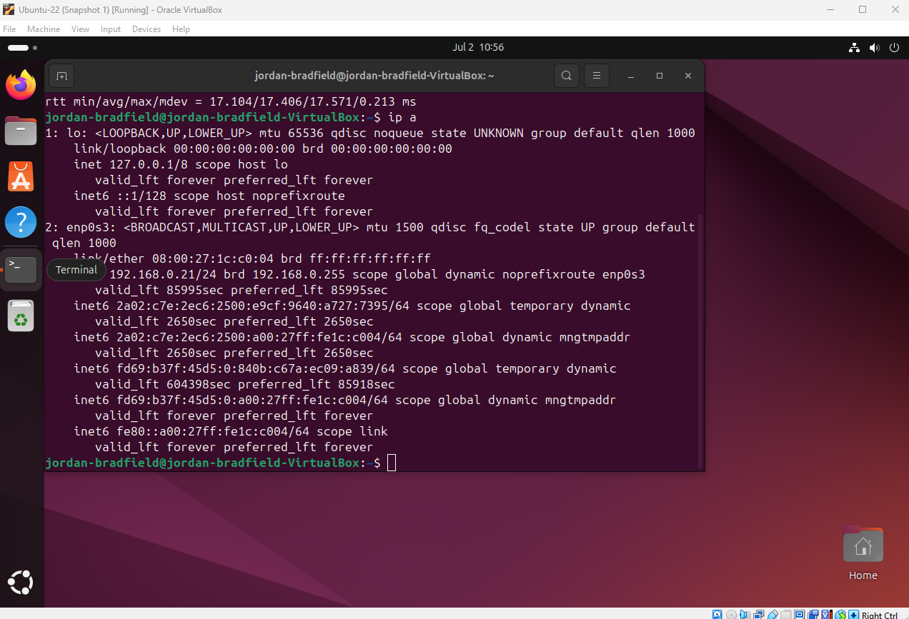

# Notes – Ticket 02: Snapshot Recovery

## Issue Overview

This issue simulated a **critical post-update failure** in a virtualized Ubuntu system. After applying system updates and configuration changes, the VM failed to boot properly, and later showed inconsistent behavior. The resolution involved using **VirtualBox snapshot recovery**, a technique essential in real world IT environments to rapidly revert to a working state.

---

## Environment

- **Virtualization Tool**: VirtualBox 7.1.6  
- **Guest OS**: Ubuntu 22.04 LTS  
- **Host OS**: Windows 11 (24H2)  
- **Snapshot Name**: `"Ubuntu Clean Install"`  
- **Snapshot Created**: 29-06-2025  

---

## Observed Symptoms

- GRUB boot failure, system unable to load desktop environment  
- Later booted to GUI with **pre-startup script warning**  
- Terminal accessible, but system behavior was unpredictable  
- Root cause suspected to stem from post-snapshot configuration changes

> These symptoms indicated a **corrupted or unstable system state**, commonly caused by interrupted updates or misconfigurations.

---

## Key Concepts & Tools

### GRUB (GRand Unified Bootloader)

- **Purpose**: GRUB loads the OS kernel and hands over control to it.  
- **Failure Signs**: Errors at this stage typically mean the system cannot continue to boot, kernel not found, corrupted file system, or broken startup services.

---

## Emergency Mode (Linux)

- **Triggered When**: Critical boot processes fail (e.g. missing mount points, corrupted filesystems, broken dependencies).  
- **Behavior**: Drops user to a minimal shell with root access. GUI does not start.  
- **Fix Strategy**:
  - Inspect logs (`journalctl -xb`)
  - Attempt repair (`fsck`, reinstall packages, or restore from backup)

---

## Snapshot Recovery Process

1. **Powered off** the Ubuntu VM  
2. Opened VirtualBox → **Snapshots** tab  
3. Selected `"Ubuntu Clean Install"`  
4. Clicked **Restore** → confirmed action  
5. VM reverted to snapshot state and rebooted  
6. Emergency mode reappeared → confirming snapshot was captured *after* the issue

> This confirmed that a new snapshot should be taken **before** major system changes, not after.

---

## Diagnostic Commands and Their Purpose

### 1. View IP configuration  
```bash
ip a
```

- **What it does**: Displays all network interfaces and their current IP addresses.
- **Why it matters**: Verifies whether the system has received an IP address from the DHCP server and is properly connected to the network.
- **Expected output**: Active network interface (e.g. `enp0s3`) with a `192.168.x.x` IP address. Loopback-only output (`127.0.0.1`) means no real network connectivity.

---

### 2. Check internet connectivity and DNS resolution  
```bash
ping google.com
```

- **What it does**: Sends ICMP echo requests to `google.com`. A response confirms that DNS is working and outbound traffic is permitted.
- **Why it matters**: If `ping` fails, the system either has no internet access, no DNS resolution, or firewall issues.
- **Expected output**: Replies from `google.com` (with time and TTL values). If you see `Temporary failure in name resolution`, it confirms a DNS or networking fault.

---

### 3. Review boot logs  
```bash
sudo less /var/log/boot.log
```

- **What it does**: Displays detailed logs from the system’s most recent boot.
- **Why it's important**: Helps identify **failed services**, misconfigurations, or critical errors that occurred during startup.  
- **Search Tips**: Look for `[FAILED]`, `dependency failed`, or service-specific messages like `gdm` or `network-manager`.

---

## Screenshot References

| Description                        | Image Path                                    |  
|------------------------------------|-----------------------------------------------|  
| Snapshot before issue              |           |  
| GRUB boot failure                  |           |  
| Pre-script warning during boot     |          |  
| Snapshot list before restore       |   |  
| Restore confirmation dialog        |  |  
| Boot log with failure indicators   |     |  
| Ping success after restore         |  |  
| IP assignment success              |        |

---

## Final Thoughts

This exercise demonstrated a **high-value IT skill**: recovering broken systems using snapshots and diagnosing underlying issues through log analysis.

Key takeaways:

- Always **create a snapshot before applying risky updates or configuration changes**.  
- Boot errors don’t always have clear causes, use logs (`boot.log`, `journalctl`) to dig deeper.  
- Tools like `ping` and `ip a` may seem basic, but they provide **critical insight** into networking and system health.  
- Snapshot recovery is **not just a safety net**, it’s an essential part of a virtualization based disaster recovery strategy.

> These recovery and diagnostic techniques are directly applicable to real world IT roles, including sysadmin, support analyst, and cloud technician roles.

---
