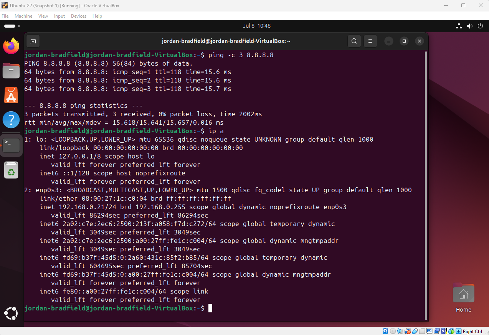
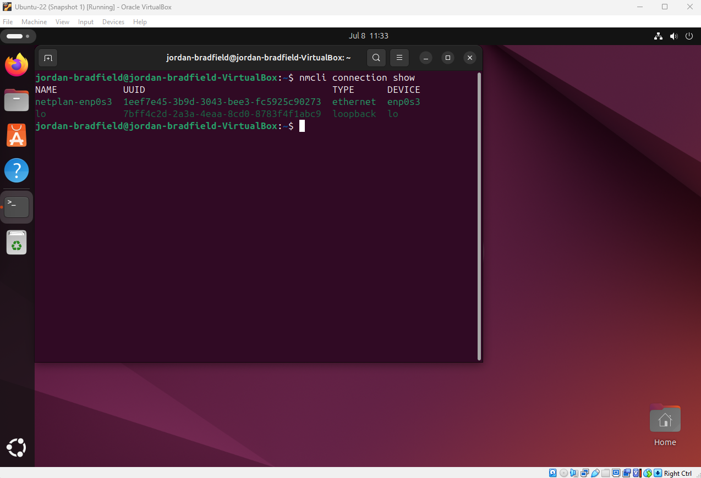
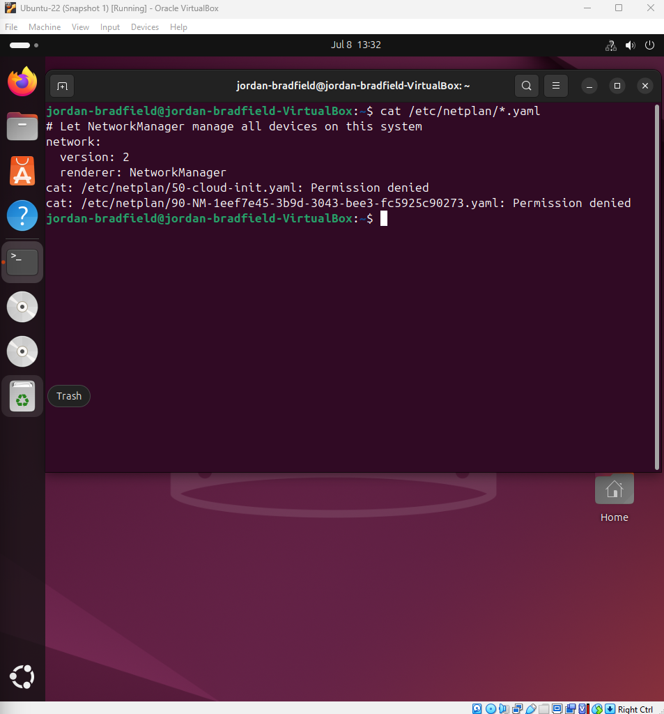
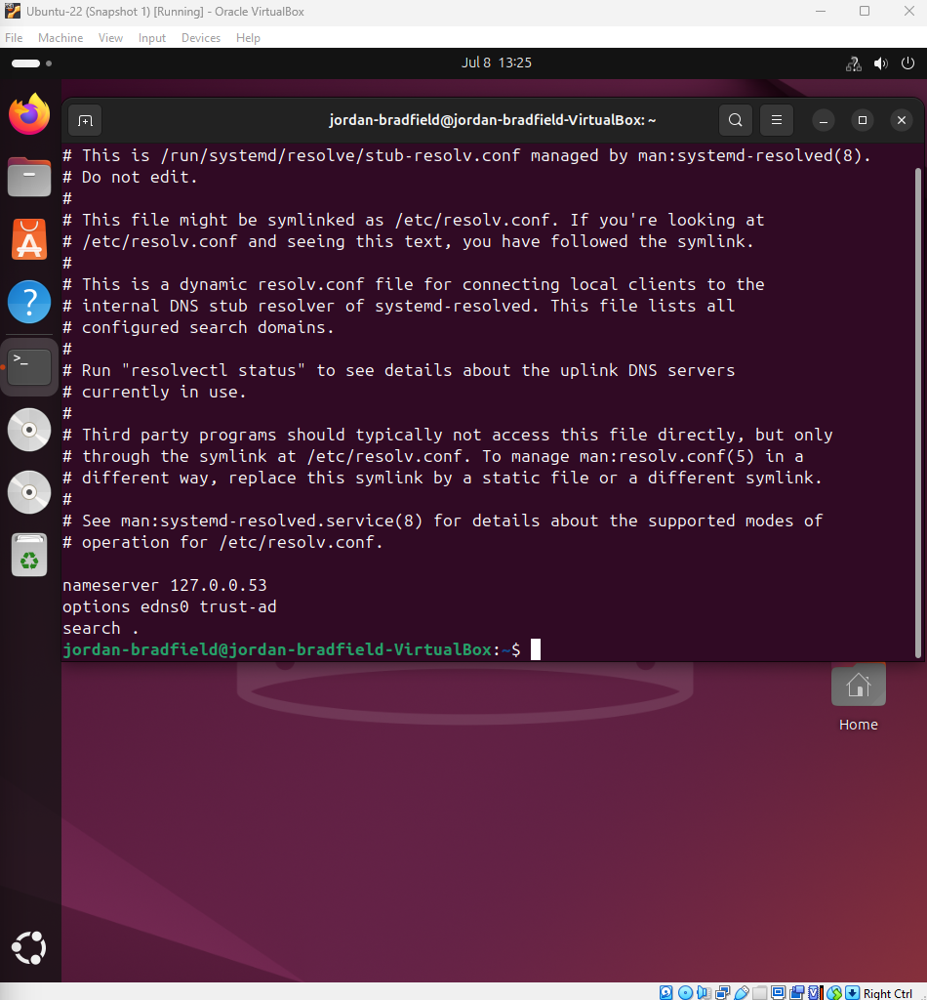
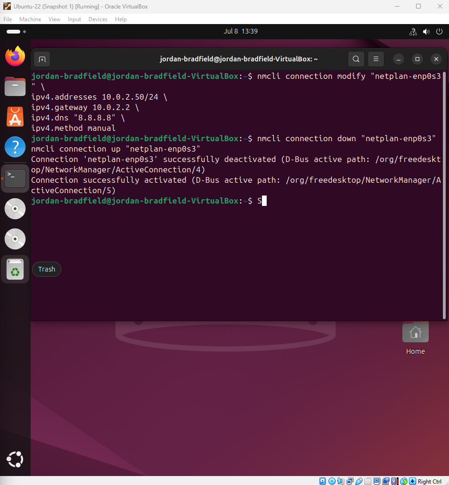
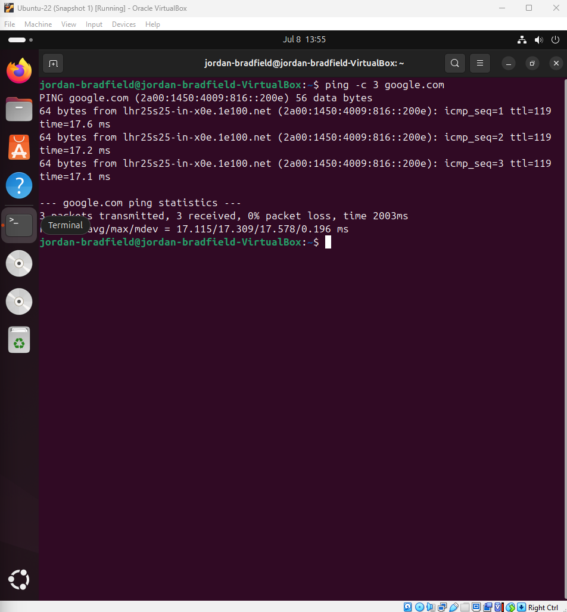

# Notes – Ticket 03: Static IP Misconfiguration

## Issue Overview

This issue simulated a common mistake in real world IT: misconfiguring a static IP address on a Linux VM, resulting in a total loss of connectivity. The objective was to troubleshoot and recover from the broken state using command-line tools and logical analysis.

---

## Environment

- **VirtualBox**: 7.1.6  
- **Guest OS**: Ubuntu 22.04 LTS  
- **Host OS**: Windows 11 (24H2)  
- **Network Mode**: NAT  
- **Account**: `jordan-bradfield` (non-root)

---

## Problem Simulation

The system was manually assigned a static IP with the wrong subnet or gateway via NetworkManager (`nmcli`). This broke routing and DNS.

---

## Step-by-Step Diagnostics

### 1. Check Current IP Address

```bash
ip a
```

- **What it does:** Lists all active interfaces and their assigned IPs.  
- **Why used:** To verify if the static IP was applied and whether DHCP was bypassed.



---

### 2. Review Routing Table

```bash
ip route
```

- **What it does:** Displays current routing rules.  
- **Why used:** To see if a default gateway exists to allow outbound traffic.


---

### 3. Inspect NetworkManager Configuration

```bash
nmcli connection show "netplan-enp0s3"
```

- **What it does:** Lists detailed config values for the specified network profile.  
- **Why used:** To confirm the static IP, gateway, and DNS settings were applied.



---

### 4. Test Network Connectivity

```bash
ping -c 3 8.8.8.8
ping -c 3 google.com
```

- **What it does:** Sends ICMP echo requests to test if the system can reach external IPs (`8.8.8.8`) or resolve domains (`google.com`).  
- **Why used:** These are **essential tools** to determine if the failure is due to routing (IP-level) or DNS (name resolution).

.png)

> **Observation**: All pings failed, indicating no route to the internet and DNS failure. Confirmed misconfiguration.

---

## Additional Troubleshooting

More low level verification was performed to isolate the cause.

```bash
cat /etc/netplan/*.yaml
cat /etc/resolv.conf
```

- **netplan** defines network configs on Ubuntu.  
- **resolv.conf** lists current DNS servers.  

  


---

## Root Cause

- The static IP (`10.0.2.50`) did not match any valid route in VirtualBox's NAT setup.  
- The gateway was unreachable or mismatched.  
- DNS servers were either missing or unreachable.  
- No default route meant no outbound traffic.

---

## Fix – Restore DHCP Configuration

The misconfigured static setup was reverted to **automatic IP allocation** (DHCP):

```bash
nmcli connection modify "netplan-enp0s3" ipv4.addresses ""
nmcli connection modify "netplan-enp0s3" ipv4.gateway ""
nmcli connection modify "netplan-enp0s3" ipv4.dns ""
nmcli connection modify "netplan-enp0s3" ipv4.method auto
nmcli connection down "netplan-enp0s3"
nmcli connection up "netplan-enp0s3"
```

  


---

## Before vs After

**Ping Failure (Static Misconfiguration)**  
.png)

**Ping Success (After DHCP Fix)**  


---

## Recovery Validation

After the fix:

- `ip a` confirmed a valid DHCP IP assigned: `192.168.x.x`  
- `ip route` showed a working default gateway  
- `/etc/resolv.conf` listed DNS servers like `8.8.8.8`  
- `ping google.com` worked again, DNS and routing both recovered

---

## Lessons & Takeaways

- Static IP configs **must include** a reachable gateway and DNS.  
- `ip route` is essential to confirm if **traffic can leave** the VM.  
- Reverting to DHCP is a reliable recovery tool in dynamic environments.  
- `nmcli`, `netplan`, and `resolv.conf` give a **layered view** of your network state.  
- This mirrors real world scenarios, like deploying laptops with static IPs in the wrong VLAN or without gateway access.

---

> **Professional Insight**  
Knowing how to recover from a failed network config **without rebooting** and using tools like `nmcli` under pressure is a real IT skill. It shows confidence, experience, and adaptability in high-stakes environments.
