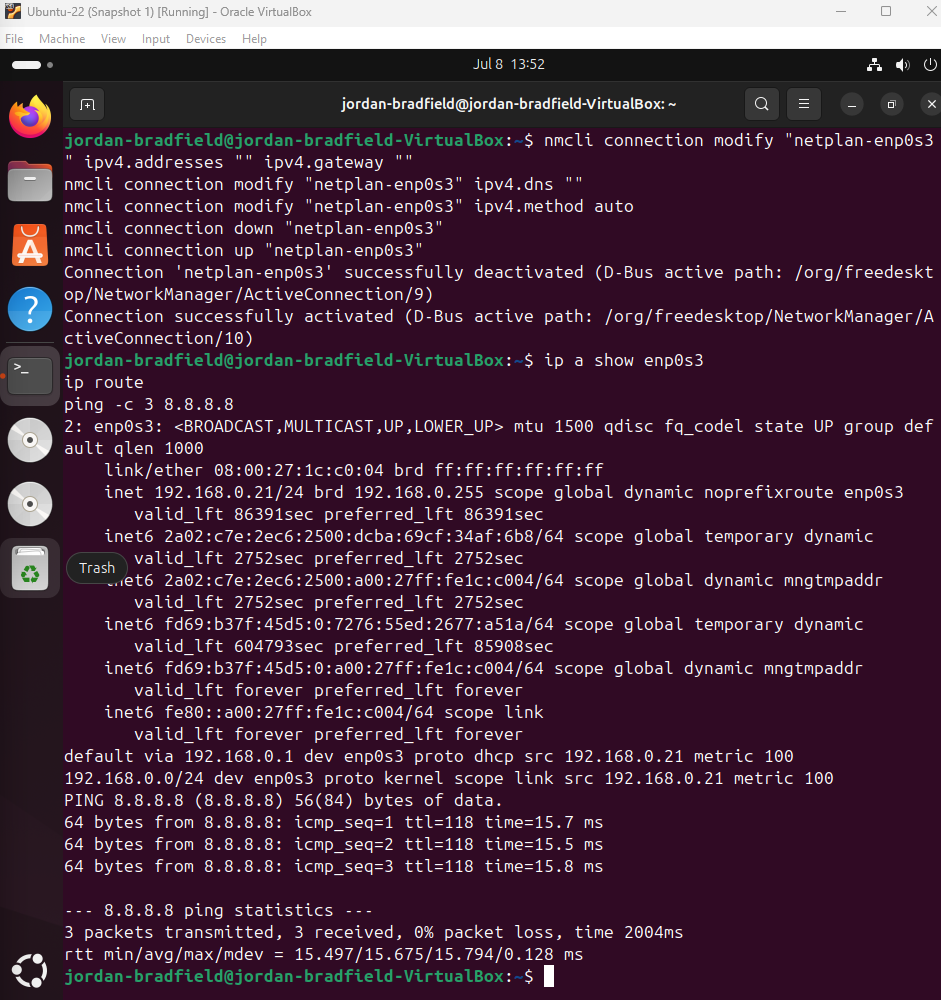

# Notes – Ticket 03: Static IP Misconfiguration

## Issue Overview
This was a realistic “oops” moment: I applied a static IP on an Ubuntu VM and broke connectivity. The aim wasn’t just to fix it—it was to show a methodical approach: confirm the scope, isolate the layer that’s failing (IP vs route vs DNS), restore service quickly, and document the learning.

---

## Environment
- VirtualBox: 7.1.6  
- Guest OS: Ubuntu 22.04 LTS  
- Host OS: Windows 11 (24H2)  
- Network Mode: NAT  
- Account: `jordan-bradfield` (non-root)

---

## What I Broke (Problem Simulation)
I set a static IP using NetworkManager with an **incorrect gateway/DNS**. That severed the VM’s path to the internet (routing) and name resolution (DNS). This mirrors common real-world incidents: wrong VLAN/subnet, mismatched gateway, or DNS pointing to a dead server.

---

## Troubleshooting Timeline (What I checked and why)

### 1) Current address & link state
Command: ip a  
- Purpose: Confirm the interface is up and what address it has (static vs DHCP).  
- Key thought: “A static IP alone doesn’t prove ‘working’; I still need a valid route.”  

---

### 2) Routing table (is there a way out?)
Command: ip route  
- Purpose: Look for a **default route**; without it, traffic can’t leave the subnet.  
- Finding: No usable default route.  

---

### 3) NetworkManager profile (what did I actually configure?)
Command: nmcli connection show "netplan-enp0s3"  
- Purpose: Verify the exact IPv4 address, gateway, and DNS I set.  
- Finding: Static values were present but wrong for this NAT network.  

---

### 4) Connectivity tests (separate routing vs DNS)
Commands:  
- ping -c 3 8.8.8.8  (tests raw IP reachability/routing)  
- ping -c 3 google.com  (adds DNS resolution to the mix)  
- Finding: Both failed → not just DNS; routing was broken too.  
.png)

---

## Additional Verification
Commands:  
- cat /etc/netplan/*.yaml  (persistent network config)  
- cat /etc/resolv.conf  (DNS servers actually in use)  

Findings: Netplan showed misaligned config; resolv.conf pointed to unreachable/missing DNS.  
  

---

## Root Cause (Plain English)
- The chosen static IP/subnet didn’t align with VirtualBox NAT.  
- The default gateway was invalid or unreachable.  
- DNS servers were missing or unreachable.  
- No valid default route → no outbound traffic (so even good DNS wouldn’t help).

---

## Resolution & Recovery
I reverted the interface back to **DHCP** so the VM could automatically pull a valid IP, gateway, and DNS from NAT:

nmcli connection modify "netplan-enp0s3" ipv4.addresses ""
    nmcli connection modify "netplan-enp0s3" ipv4.gateway ""
    nmcli connection modify "netplan-enp0s3" ipv4.dns ""
    nmcli connection modify "netplan-enp0s3" ipv4.method auto
    nmcli connection down "netplan-enp0s3"
    nmcli connection up "netplan-enp0s3"

Screenshots:  
  

---

## Before vs After
**Ping Failure (Static Misconfiguration)**  
.png)

**Ping Success (After DHCP Fix)**  

---

## Recovery Validation
After the fix:
- ip a → valid DHCP lease (192.168.x.x)  
- ip route → correct default gateway present  
- /etc/resolv.conf → working DNS servers  
- ping google.com → routing + DNS confirmed healthy

---

## Command Cheat Sheet (What each tool did for me)
- ip a — Shows interfaces, state, and IPs. First, I proved the static IP was applied.  
- ip route — Shows the routing table. Missing/invalid default route explained the failure.  
- nmcli connection show "netplan-enp0s3" — Revealed exactly which static values were set.  
- ping 8.8.8.8 — Tests routing to a known external IP (ignores DNS).  
- ping google.com — Adds DNS to the test; if this fails but 8.8.8.8 works, it’s a DNS issue.  
- cat /etc/netplan/*.yaml — Persistent network config; errors here break connectivity at boot.  
- cat /etc/resolv.conf — DNS servers the system is actually using.  
- nmcli connection modify … — Cleared static settings and set DHCP (ipv4.method auto).  
- nmcli connection down/up — Restarted the connection so changes took effect immediately.

---

## Lessons & What I’d Do Next Time
- Static IPs must be complete: **IP + subnet + gateway + DNS** and must match the network design.  
- Always check **ip route** early; it quickly tells you if there’s any way out.  
- Test in layers: ping an IP first (routing), then a hostname (DNS).  
- In a pinch, revert to **DHCP** to restore service fast, then reapply a correct static config with the right gateway.  
- This was a service restoration scenario in ITIL terms: identify the error, restore service quickly, document the root cause, and prevent recurrence.
