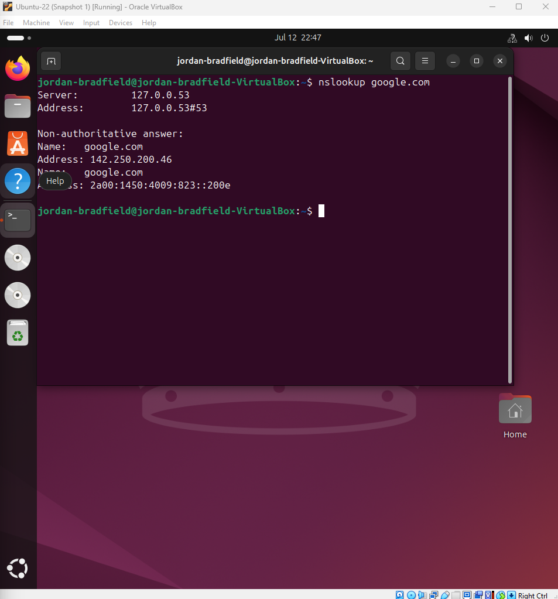

# Notes – Ticket 04: Firewall Blocking Internet Access

## Issue Overview

This issue simulated a common real world IT problem: a firewall misconfiguration blocking outbound internet traffic on a Linux VM. It highlighted how restrictive firewall rules can silently disrupt critical services and internet access, and showed the importance of carefully managing firewall policies.

---

## Environment

- Ubuntu 22.04 LTS VM  
- UFW (Uncomplicated Firewall) enabled  
- VirtualBox NAT networking mode  
- Connectivity tested using `ping` and `curl` commands  

---

## Symptoms Observed

- Outbound internet access blocked after applying strict UFW rules  
- DNS resolution still functional (allowed through firewall)  
- `ping` to external IPs failed with "Destination unreachable"  
- Web browsing and package installs via `apt` failed  

These symptoms indicated outbound HTTP, HTTPS, and ICMP traffic were being blocked by UFW.

---

## Key Diagnostic Commands and Their Purpose

### 1. Block outbound traffic except DNS and DHCP (Recreate issue):  
```bash
sudo ufw default deny outgoing
sudo ufw allow out 53
sudo ufw allow out to 192.168.0.1 port 67 proto udp
```
- **What it does:** Denies all outgoing traffic by default, except DNS (port 53) and DHCP (port 67) to allow name resolution and IP address leasing.  
- **Why:** To simulate a restrictive firewall environment causing connectivity failure.

### 2. Check firewall status:  
```bash
sudo ufw status verbose
```
- **What it does:** Shows current UFW rules and default policies.  
- **Why:** To confirm firewall configuration is as intended.

### 3. Test DNS resolution:  
```bash
nslookup google.com
```
- **What it does:** Queries DNS servers to resolve a domain name.  
- **Why:** To verify DNS is allowed through firewall.

### 4. Test ping to external IP:  
```bash
ping 8.8.8.8
```
- **What it does:** Sends ICMP echo requests to Google's public DNS.  
- **Why:** To test basic outbound connectivity, which was blocked.

### 5. Test HTTP access with curl:  
```bash
curl -I https://example.com
```
- **What it does:** Makes a HTTP HEAD request to check server response.  
- **Why:** To confirm HTTP/HTTPS outbound traffic is blocked or allowed.

### 6. Attempt to install curl package:  
```bash
sudo apt install curl
```
- **What it does:** Installs curl using apt package manager.  
- **Why:** To check if HTTP/HTTPS traffic is blocked by firewall during package installs.

---

## Investigation & Findings

- DNS resolution succeeded (`nslookup` returned valid IPs), proving DNS outbound allowed.  
- Ping failed with 100% packet loss, indicating ICMP blocked outbound.  
- `curl` requests timed out, showing HTTP/HTTPS blocked.  
- `apt install` failed due to inability to fetch from repos.  
- UFW status confirmed default deny outgoing, with only DNS and DHCP allowed outbound.

---

## Fix Applied

To restore internet access, outbound HTTP (port 80) and HTTPS (port 443) were explicitly allowed:

```bash
sudo ufw allow out 80/tcp
sudo ufw allow out 443/tcp
```

- This permits web traffic for browsers, package managers, and tools like curl.

---

## Verification After Fix

### 1. Ping test to external IP:

```bash
ping -c 4 8.8.8.8
```
- **Result:** Successful replies confirmed ICMP outbound now allowed.

### 2. Curl HTTP test:

```bash
curl -I https://example.com
```
- **Result:** HTTP 200 OK response headers confirmed HTTP/HTTPS working.

### 3. Apt update and install:

```bash
sudo apt update
sudo apt install curl -y
```
- **Result:** Packages updated and curl installed successfully, confirming HTTP(S) access.

### 4. IPv6 Ping test:

```bash
ping6 -c 4 google.com
```
- **Result:** Successful IPv6 connectivity also verified.

---

\\\## Screenshot References

| Description                          | Image Path                                |
|------------------------------------|------------------------------------------|
| UFW blocking outbound traffic       | |
| Ping failure before fix             |   |
| Failed apt install due to firewall  |  |
| DNS resolution success              |           |
| UFW status verbose showing rules    | |
| Allowed outbound HTTP (port 80)     |       |
| Allowed outbound HTTPS (port 443)   |      |
| Successful ping after fix           |      |
| Successful curl HTTP request        |      |
| Successful apt update               | |
| Curl install success                |  |
| Curl web request output             |      |
| IPv6 ping success                   |      |

---

## Final Reflection

This ticket underscored the critical role firewall rules play in network connectivity. Even well intentioned restrictions can silently block essential traffic like HTTP and HTTPS, breaking package updates and web access. 

Careful review and staged testing using commands like `nslookup`, `ping`, `curl`, and `apt` helped pinpoint what traffic was blocked and why.

Explicitly allowing necessary outbound ports restored full functionality, showing the importance of understanding protocol ports and firewall policies.

Documenting these changes provides a reference for future firewall troubleshooting and highlights best practices for managing restrictive security setups.

This exercise was challenging but invaluable, demonstrating how detailed analysis and methodical troubleshooting solve real IT problems caused by security misconfigurations.

---