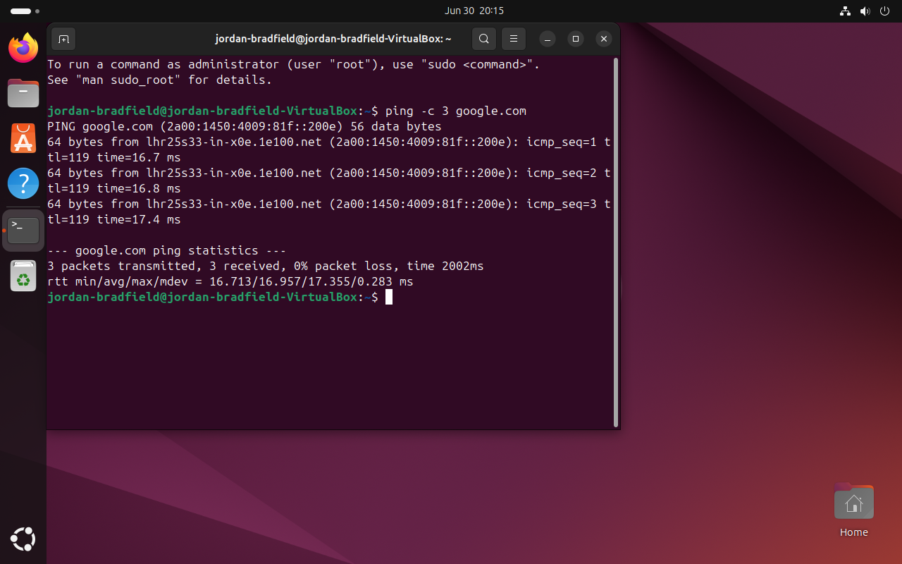

# Ticket 01 – Network Adapter Failure

## Incident Logging
- **Ticket ID:** 0001-NAF  
- **Date/Time Reported:** 29-06-2025, 20:43 GMT  
- **Reported by:** Internal user *jordanb*  
- **Channel:** Internal IT support request  

---

## Categorisation & Priority
- **Category:** Network / Connectivity  
- **Impact:** Single user (Ubuntu VM only)  
- **Urgency:** High (complete loss of connectivity)  
- **Priority:** P2 (High)  

---

## Issue Summary
Ubuntu VM unable to connect to the internet due to disabled virtual network adapter in VirtualBox.  

---

## Environment
- VirtualBox 7.1.6  
- Ubuntu 22.04  
- Host: Windows 11 (24H2)  
- Network Mode: Bridged Adapter  

---

## Symptoms
- No network icon in Ubuntu  
- `ping` fails with: *Temporary failure in name resolution*  
- `ip a` shows loopback only  

---

## Investigation & Diagnosis
- Checked GUI network status → no connectivity  
- Ran `ip a` → no IP address assigned  
- `ping google.com` failed (DNS not resolving)  
- **Root Cause:** VirtualBox network adapter was disabled  

---

## Resolution & Recovery
1. Powered off VM  
2. Opened **VirtualBox → VM Settings → Network**  
3. Enabled **Adapter 1**  
4. Set adapter to **Bridged Mode** (host Ethernet interface)  
5. Booted VM and tested connectivity  

---

## Verification
- `ping google.com` successful ✅  
- IP address received via DHCP (`ip a`)  
- Browser loaded websites normally  
- User confirmed resolution  

---

## Closure
- Ticket status set to *Resolved*  
- Confirmed with reporting user before closure  

---

## Lessons Learned
- Add VM deployment checklist to prevent adapter misconfiguration  
- Highlighted importance of checking virtualization layer, not just OS  

---

## Next Steps – Firewall Rules

### What to Demonstrate
- Configure and test firewall rules using UFW (Linux), Windows Firewall, or pfSense.
- Block or allow specific ports (e.g., HTTP, HTTPS) to simulate real-world scenarios.
- Replicate a user report such as *“I can’t access the web server”* and confirm blocked traffic through inspection.
- Troubleshoot by reviewing logs (`ufw status`, Windows Firewall logs, pfSense rule logs).

### Example Future Ticket
**Issue:** Users unable to access an internal web application.  
**Root Cause:** pfSense firewall blocking TCP port 443.  
**Resolution:** Created a rule allowing HTTPS traffic from VLAN 30 to the server, confirmed access was restored.  

---

## Screenshots

| Description                        | Image                                 |
|------------------------------------|----------------------------------------|
| Adapter disabled in VirtualBox     |    |
| Ubuntu shows no connectivity       |   |
| Failed ping test                   |        |
| Adapter re-enabled                 |     |
| IP address assigned via DHCP       |        |
| Successful ping after fix          |        |
