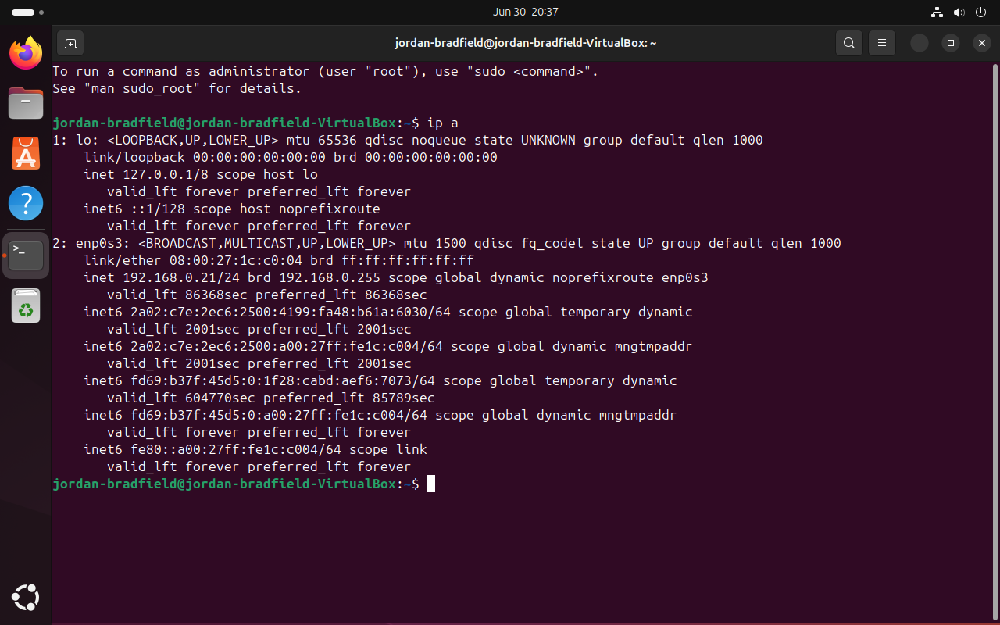

# Ticket 01 – Network Adapter Failure

## Ticket Source
- **Ticket ID:** 0001-NAF (Network Adapter Failure)
- **Date Reported:** 29-06-2025
- **Time Reported:** 20:43 GMT
- **Reported by:** Internal user "jordanb"
- **Received via:** Internal IT support request

---

## Issue Summary
Ubuntu VM was unable to connect to the internet due to a disabled virtual network adapter in VirtualBox.

---

## Environment
- VirtualBox 7.1.6
- Ubuntu 22.04
- Host: Windows 11 Version 24H2
- Network Mode: Bridged Adapter

---

## Symptoms
- No internet/network icon in Ubuntu
- Terminal `ping` shows: `Temporary failure in name resolution`
- No IP address assigned (`ip a` shows loopback only)

---

## Initial Diagnostics
- Checked network status in GUI (top-right)
- Ran `ip a` – no IP address assigned
- `ping google.com` failed (name resolution error)

---

## Root Cause
The network adapter was disabled in VirtualBox settings for the VM.

---

## Resolution Steps
1. Powered off the VM
2. Opened **VirtualBox → VM Settings → Network**
3. Enabled **Adapter 1**
4. Set it to **Bridged Adapter**
5. Attached to host's Ethernet interface
6. Booted VM and tested connectivity

---

## Verification
- Ran `ping google.com` – reply received ✅
- IP address assigned via DHCP (confirmed via `ip a`)
- Browser loaded websites normally

---

## Screenshots

| Description                        | Image                                 |
|------------------------------------|----------------------------------------|
| Adapter disabled in VirtualBox     |    |
| Ubuntu shows no connectivity       |   |
| Failed ping test                   |        |
| Adapter re-enabled                 |     |
| IP address assigned via DHCP       |        |
| Successful ping after fix          |        |

---

## Reflection
I tried to make this feel like a realistic IT support issue, something that could easily happen in a real environment. It was a great reminder that not all network issues come from within the OS itself. Sometimes, the problem lies in the virtualization layer. Walking through each stage helped me think more methodically, and writing it up reinforced how valuable it is to document clearly so the solution is easy to follow and repeat later.
