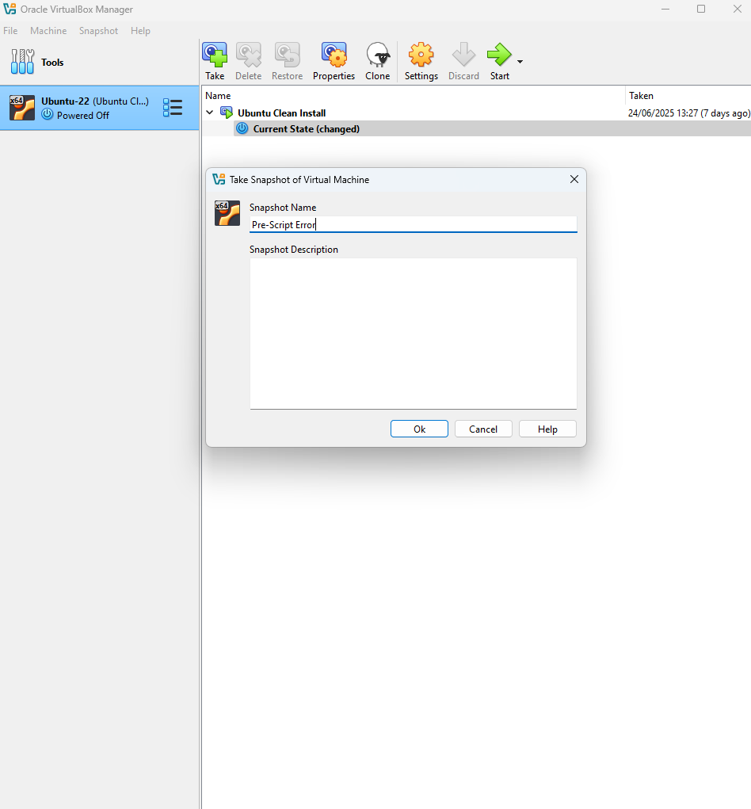
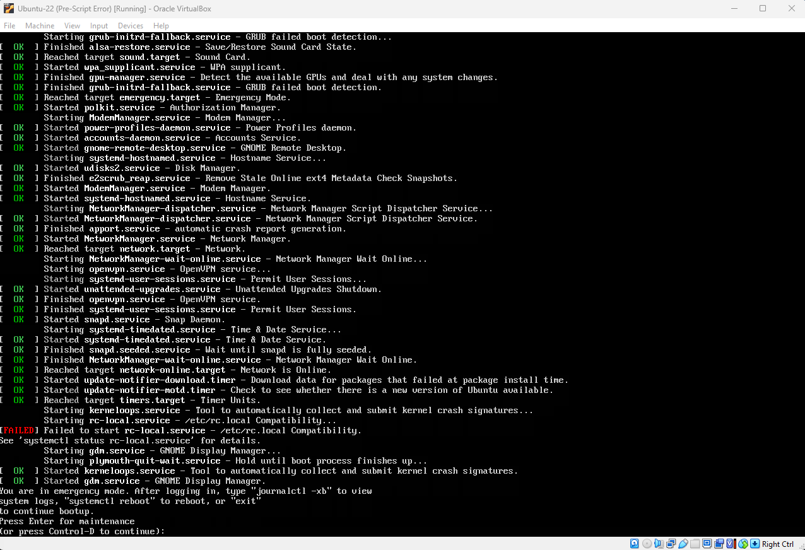
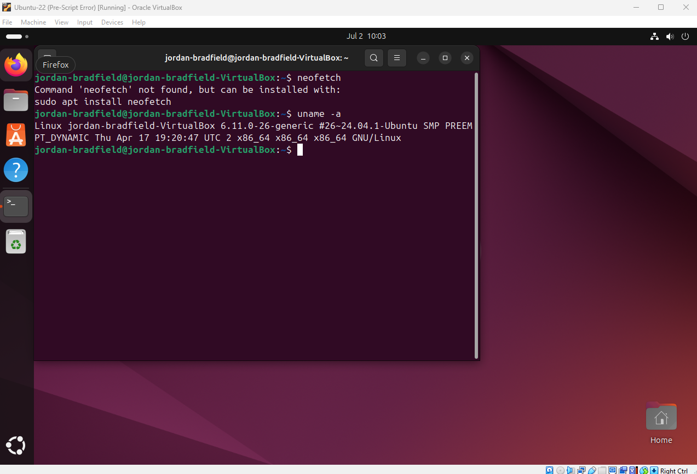
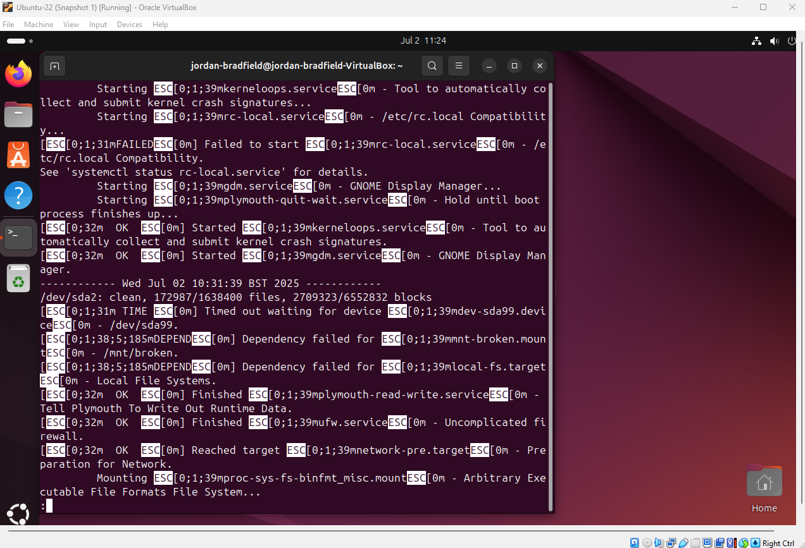
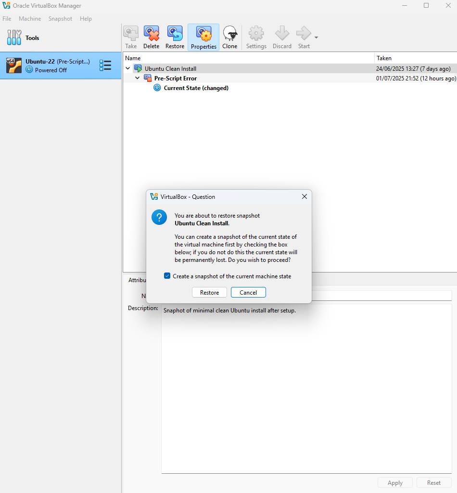
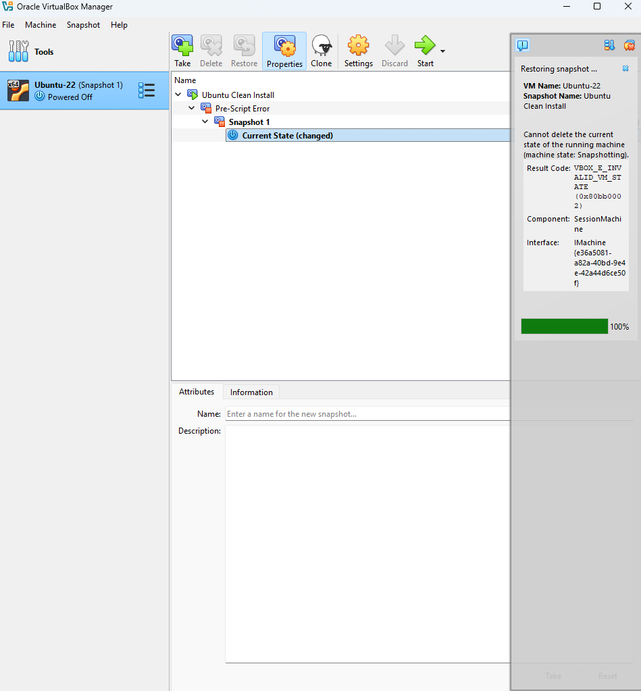
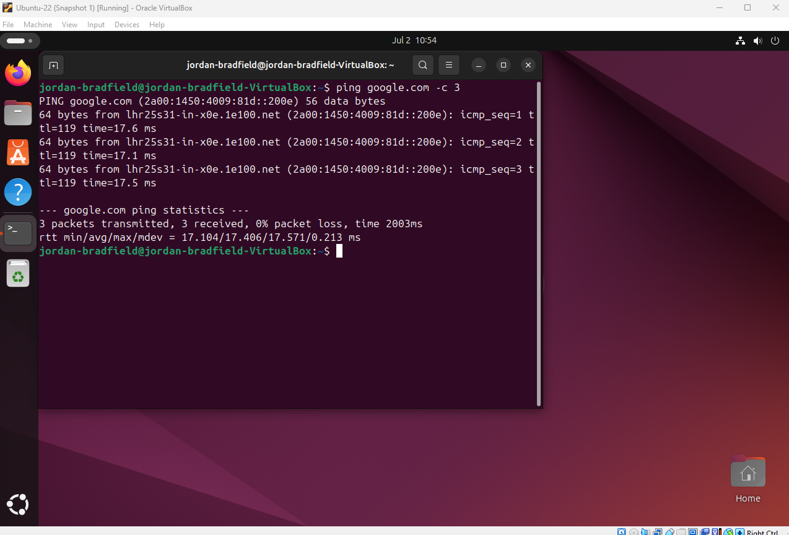
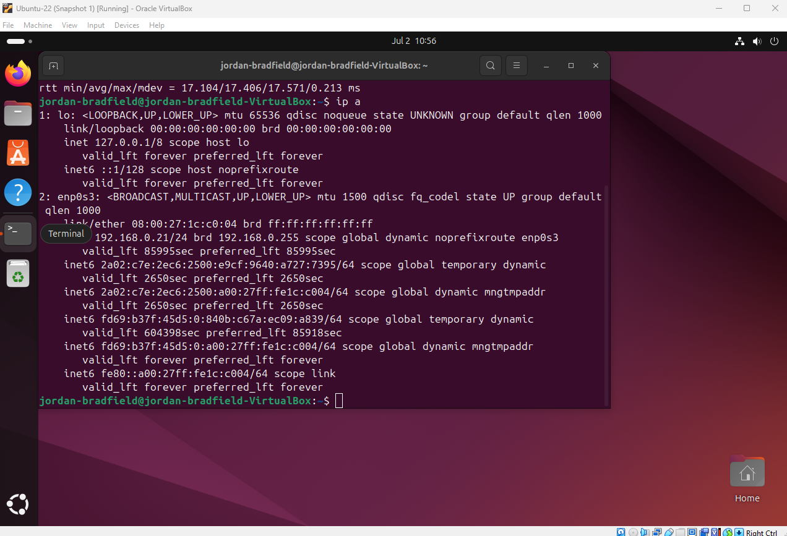

# Ticket 02 – Snapshot Recovery

## Incident Logging
- **Ticket ID:** 0002-SR  
- **Date/Time Reported:** 01-07-2025, 21:15 GMT  
- **Reported by:** Internal user *jordanb*  
- **Channel:** Internal IT support request  

---

## Categorisation & Priority
- **Category:** Virtualization / System Recovery  
- **Impact:** Single VM (Ubuntu 22.04)  
- **Urgency:** High (system unstable and unbootable)  
- **Priority:** P2 (High)  

---

## Issue Summary
Following system updates and configuration changes, the Ubuntu VM entered an unstable state and frequently failed to boot. Errors included GRUB boot failures and pre-startup script warnings, creating an unreliable environment for the user.  

To restore functionality, a snapshot recovery process was initiated, highlighting the importance of maintaining well-timed snapshots as a safety net for rapid system rollback.
  
---

## Environment
- VirtualBox 7.1.6  
- Ubuntu 22.04 LTS  
- Host OS: Windows 11 (24H2)  
- Snapshot: **Ubuntu Clean Install**  
- Snapshot Date: 29-06-2025  

---

## Symptoms
- VM failed to boot reliably, often halting with GRUB error messages.  
- In cases where the system did load, warnings appeared referencing failed pre-startup scripts, signaling deeper instability.  
- Overall, the environment could not be trusted for consistent operation.  
  

| Description                     | Image                                 |
|---------------------------------|----------------------------------------|
| Snapshot before issue           |      |
| GRUB boot failure               |      |
| Pre-script warning during boot  |     |

---

## Investigation & Diagnosis
- Attempted to roll back to the snapshot **“Ubuntu Clean Install”** using VirtualBox.  
- Post-restore, the VM entered **emergency mode**, confirming the snapshot had preserved the unstable configuration rather than a clean baseline.  
- System logs reviewed for clarity:
  - `/var/log/boot.log` showed multiple `[FAILED]` service units, indicating systemic issues.  
  - `systemctl list-units --failed` provided a quick overview of failed services for faster triage.  
  - `journalctl -xb` was consulted for detailed boot logs beyond the standard boot.log file.    

| Description                    | Image                                     |
|--------------------------------|--------------------------------------------|
| Boot log with failures         |    |

**Root Cause:**  
The snapshot had been captured *after* the problematic updates and misconfigurations, locking in the faulty system state instead of providing a safe recovery point.   

---

## Resolution & Recovery
1. Powered off the VM to ensure a clean restore process.  
2. Restored the snapshot via **VirtualBox → Snapshots tab**.  
3. Booted the VM and verified system state.  

### Post-Restore Verification Steps
- **Boot Logs:**  
  Reviewed boot output using `journalctl -xb` to capture full details of the most recent boot. This provided more context than `/var/log/boot.log`, confirming that several failed services were recorded during startup.  

- **Service Health Check:**  
  Ran `systemctl list-units --failed` to quickly identify failed units. This confirmed degraded services that matched the earlier boot log errors.  

- **Disk Space Check:**  
  Verified available storage with `df -h`. This ruled out disk space exhaustion as a possible root cause for the unstable system behavior.  

- **Network & Connectivity Tests:**  
  Confirmed the VM had network access:  
  - `ip a` showed a valid DHCP-assigned IP address.  
  - `ping google.com` returned successful responses, verifying external connectivity and DNS resolution.  

Although screenshots were not captured for these specific commands, the diagnostic process was recorded in detail to demonstrate a systematic recovery approach.  

| Description                    | Image                                         |
|--------------------------------|------------------------------------------------|
| Snapshot list before restore   |      |
| Restore confirmation dialog    |     |
| Ping test after restore        |   |
| IP assigned after restore      |           |

---

## Verification
- VM booted successfully to Ubuntu desktop.  
- `ping google.com` succeeded ✅  
- `ip a` showed DHCP-assigned IP address ✅  
- User confirmed system stability and functionality.  

---

## Closure
- Ticket status set to *Resolved*.  
- Confirmed recovery with reporting user prior to closure.  
- Documented additional escalation options for future incidents (e.g., GRUB repair with `grub-install`, booting via a Live ISO, or filesystem checks with `fsck`).  
- This case sets the foundation for more advanced troubleshooting, which will be demonstrated in the next ticket covering firewall misconfiguration.  

---

## Lessons Learned
- Snapshot strategy is critical: always capture snapshots *before* applying major updates or configuration changes, not after.  
- Restoring from a snapshot may not always guarantee recovery, always prepare escalation paths such as:  
  - Reviewing failed services via `systemctl list-units --failed`.  
  - Checking boot sequence details with `journalctl -xb`.  
  - Repairing GRUB (`grub-install` + `update-grub`) if bootloader corruption is suspected.  
  - Using `fsck` or a Live ISO to repair deeper filesystem or startup issues.  
- Diversifying diagnostic commands (`ping`, `ip a`, `df -h`, log review tools) provides a more comprehensive health check of the system.  
- Inconsistent boot behavior emphasises the importance of **thorough log review** rather than relying on surface-level checks.  
- A well-planned snapshot and escalation strategy reduces downtime and demonstrates resilience in troubleshooting.  

---
