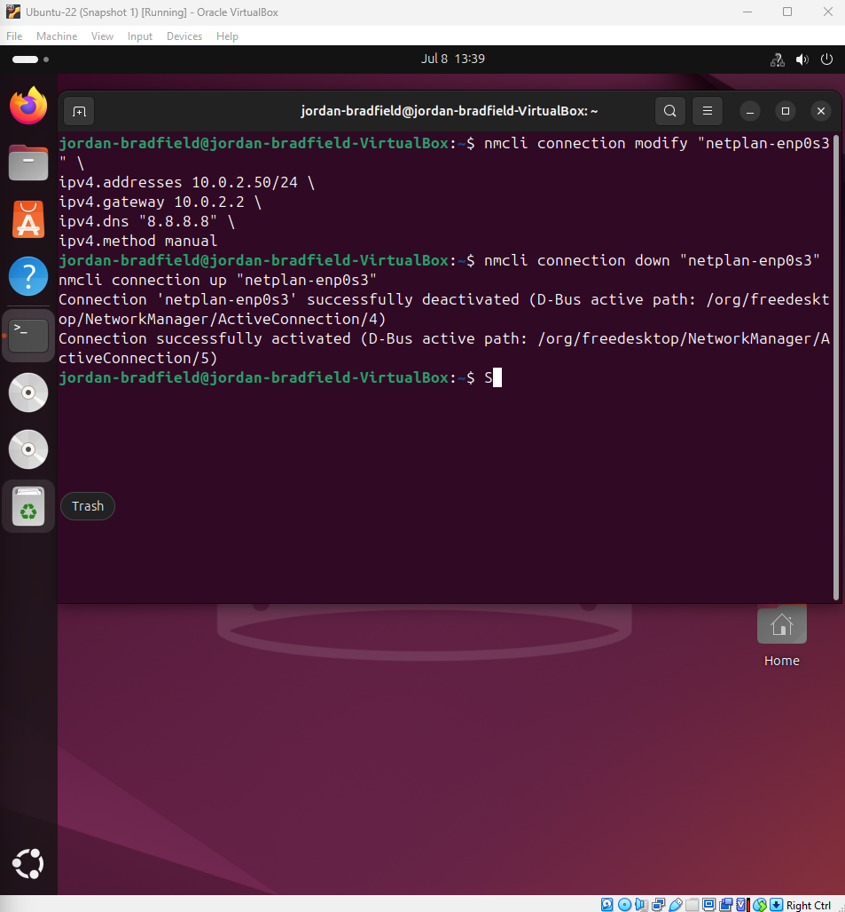

# Ticket 03 – Static IP Misconfiguration

## Incident Logging
- Ticket ID: 0003-SIP
- Date/Time Reported: 08-07-2025, 16:33 GMT
- Reported by: Internal user "jordanb"
- Channel: Internal IT support request

---

## Categorisation & Priority
- Category: Network / Connectivity
- Impact: Single VM (Ubuntu)
- Urgency: High (complete loss of connectivity)
- Priority: P2 (High)

---

## Issue Summary
After manually assigning a static IP to the Ubuntu VM’s network interface using NetworkManager, the system lost internet connectivity. The user was unable to reach external IPs and domains, indicating a misconfiguration of network parameters.

---

## Environment
- VirtualBox 7.1.6
- Ubuntu 22.04 LTS
- Host OS: Windows 11 Version 24H2
- Network Interface: netplan-enp0s3

---

## Symptoms
- Loss of internet connectivity after static IP assignment
- ping -c 3 8.8.8.8 and ping -c 3 google.com failed
- Routing table missing correct default gateway
- DNS resolution not functional
- IP assigned but no external connectivity

---

## Investigation & Diagnosis
### Commands Used
ip a
ip route
nmcli connection show "netplan-enp0s3"
cat /etc/netplan/*.yaml
cat /etc/resolv.conf

### Observations
- IP address manually set but gateway incorrect or missing
- Routing table showed no path to external networks
- DNS resolution failed
- Netplan YAML misconfigured
- NetworkManager settings applied but invalid

### Screenshots
| Description | Screenshot |
|-------------|------------|
| ip a output |  |
| ip route output |  |
| Netplan YAML |  |
| nmcli connection show |  |
| resolv.conf |  |

> Root cause confirmed: static IP misconfiguration blocking routing and DNS

---

## Resolution & Recovery

### Fix Applied

Reverted the network interface to DHCP using NetworkManager. This ensures the system obtains a working dynamic IP configuration:

nmcli connection modify "netplan-enp0s3" ipv4.addresses ""
nmcli connection modify "netplan-enp0s3" ipv4.gateway ""
nmcli connection modify "netplan-enp0s3" ipv4.dns ""
nmcli connection modify "netplan-enp0s3" ipv4.method auto
nmcli connection down "netplan-enp0s3"
nmcli connection up "netplan-enp0s3"

### Verification
- ip a shows valid dynamic IP
- ip route confirms correct default gateway
- resolv.conf lists valid DNS
- ping -c 3 8.8.8.8 and ping -c 3 google.com successful

| Description | Screenshot |
|-------------|------------|
| Static IP applied but no connectivity |  |
| DHCP restored |  |
| Ping successful |  |

---

## Closur
- Ticket status set to Resolved
- User confirmed access restored

---

## Lessons Learned
- Static IP configuration must include IP, gateway, and DNS
- Misconfigured gateway or NAT can block connectivity
- Reverting to DHCP quickly confirms root cause
- Structured ITIL workflow: log, categorise, investigate, resolve, verify, reflect
- nmcli, ip route, and resolv.conf are essential troubleshooting tools
