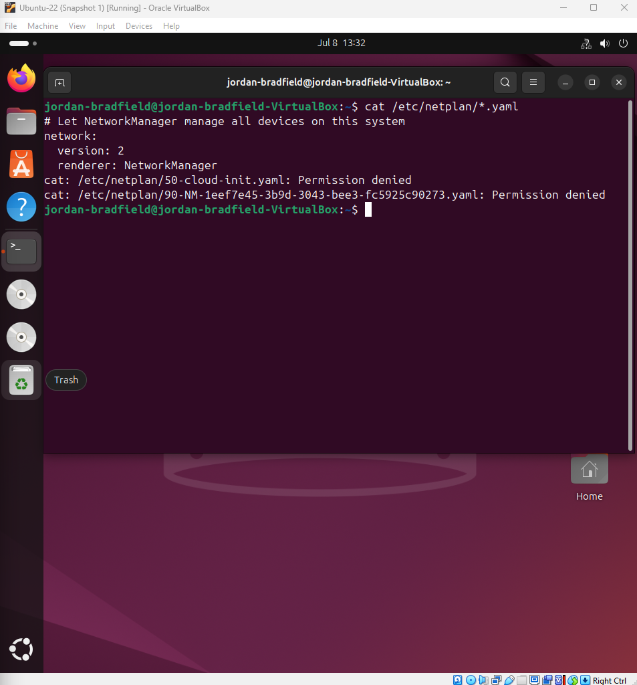

# Ticket 03 – Static IP Misconfiguration

## Ticket Source
- **Ticket ID:** 0003-SIP (Static IP Misconfiguration)
- **Date Reported:** 08-07-2025
- **Time Reported:** 16:33 GMT
- **Reported by:** Internal user "jordanb"
- **Received via:** Internal IT support request

## Issue Summary
After manually assigning a static IP address to the Ubuntu VM’s network interface using NetworkManager, the system lost internet connectivity. The user reported inability to reach external IPs and domains, indicating a misconfiguration of network parameters.

---

## 1. Recreate the Issue

The Ubuntu VM was started, and a static IP address was manually assigned using NetworkManager. The configuration was intentionally misconfigured to simulate a network failure.

### Steps Performed

- Checked the current IP configuration:

```
ip a
```


- Applied a static IP with an incorrect gateway and subnet mask.


- Verified the routing table to confirm the default route:

```
ip route
```


- Inspected the NetworkManager connection details:

```
nmcli connection show "netplan-enp0s3"
```


- Tested network connectivity by pinging an external IP and domain:

```
ping -c 3 8.8.8.8
ping -c 3 google.com
```

.png)

### Observed Result

Both ping commands failed, confirming the network misconfiguration prevented internet access.

## 2. Investigate & Isolate the Problem

After confirming the network was unreachable, we began isolating the root cause.

### Commands Used:

```bash
ip a
ip route
nmcli connection show
cat /etc/netplan/*.yaml
cat /etc/resolv.conf
```

Each command provided insight into potential misconfiguration issues at different network layers.

---

### Investigation Output:

| Description                            | Screenshot                                      |
|----------------------------------------|-------------------------------------------------|
| `ip a` output – verified current IP     |            |
| `ip route` – checked default route      |        |
| Netplan YAML – reviewed config file     |                  |
| `nmcli` – validated connection settings |                    |
| DNS config – `/etc/resolv.conf`         |                   |

---

### Observations:

- IP address was set manually, but the default gateway was missing or incorrect.
- Routing table (`ip route`) showed no usable path to external networks.
- DNS resolution failed due to either no server or an unreachable server.
- `netplan` YAML file lacked or misrepresented key networking fields.
- `nmcli` confirmed the changes had applied but were misconfigured.

> These symptoms confirmed a classic static IP misconfiguration: routing and DNS were incomplete, resulting in total internet loss.

## 3. Fixing the Misconfiguration

After confirming that the static IP assignment was causing connectivity issues, corrective action was taken.

### Problem Recap

After manually assigning a **static IP address** to the Ubuntu VM using `nmcli`, the system was **unable to access the internet**. Specifically:

- The static IP (`10.0.2.50/24`), gateway (`10.0.2.2`), and DNS (`8.8.8.8`) were configured via `nmcli`.
- Despite being applied correctly, `ping` tests to external IPs like `8.8.8.8` failed with `Destination Host Unreachable`.
- Network interface settings showed the static IP was applied, but there was **no default route connectivity**, likely due to a misconfigured or unreachable gateway, or incorrect NAT handling in VirtualBox.

### Fix Applied

The static configuration was reverted to use **DHCP**, allowing the system to obtain a working dynamic IP configuration.

```bash
nmcli connection modify "netplan-enp0s3" ipv4.addresses ""
nmcli connection modify "netplan-enp0s3" ipv4.gateway ""
nmcli connection modify "netplan-enp0s3" ipv4.dns ""
nmcli connection modify "netplan-enp0s3" ipv4.method auto
nmcli connection down "netplan-enp0s3"
nmcli connection up "netplan-enp0s3"
```

| Description                                | Image                                     |
|--------------------------------------------|-------------------------------------------|
| Static IP applied but no connectivity      |           |
| DHCP settings re-applied to restore access |               |
| Successful ping to 8.8.8.8 after fix       | |

---

## 4. Recovery Verification

After reverting to DHCP:

- `ip a` showed a valid dynamic IP (`192.168.0.x`)
- `ip route` confirmed a correct default gateway
- `/etc/resolv.conf` showed valid DNS servers
- Pings to both `8.8.8.8` and `google.com` succeeded

This confirmed full recovery of the network stack and validated that the original issue was caused by an incorrect static configuration.

---

## 5. Log & Reflection

This misconfiguration was caused by an incomplete or incorrect static IP setup using `nmcli`. While the IP address itself was correctly assigned, the lack of a working route prevented outbound traffic.

### What I Learned

- Setting a static IP requires **carefully configuring all details**: IP, gateway, and DNS.
- Forgetting to match the **gateway to the network range** or failing to account for **VirtualBox NAT settings** can result in no internet access.
- Reverting to DHCP is a reliable way to quickly restore connectivity and confirm the root cause.
- `nmcli`, `ip route`, and `resolv.conf` are critical tools for network troubleshooting.

This is the kind of situation I would expect to face in real IT support scenarios, where identifying and reversing configuration errors under pressure is key to fast recovery.


