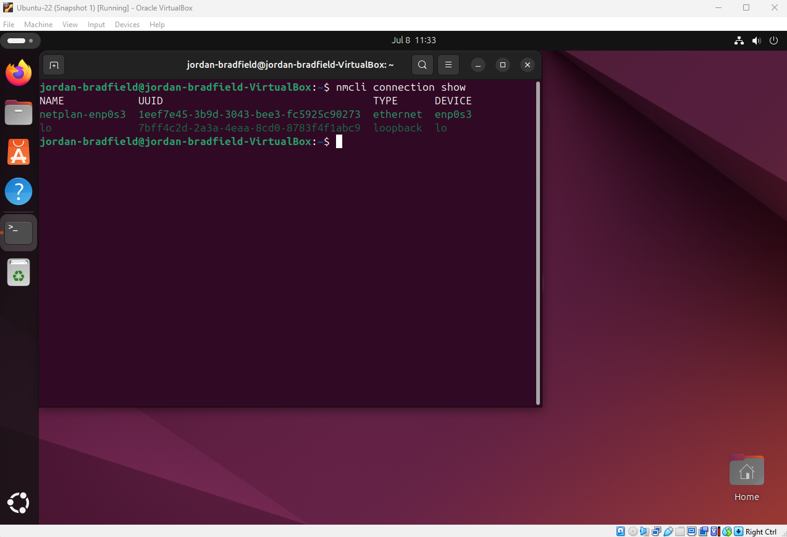

# Ticket 03 – Static IP Misconfiguration

## Ticket Source
- **Ticket ID:** 0003-SIP (Static IP Misconfiguration)
- **Date Reported:** 08-07-2025
- **Time Reported:** 16:33 GMT
- **Reported by:** Internal user "jordanb"
- **Received via:** Internal IT support request

## Issue Summary
After manually assigning a static IP address to the Ubuntu VM’s network interface using NetworkManager, the system lost internet connectivity. The user reported inability to reach external IPs and domains, indicating a misconfiguration of network parameters.

---

## 1. Recreate the Issue

The Ubuntu VM was started, and a static IP address was manually assigned using NetworkManager. The configuration was intentionally misconfigured to simulate a network failure.

### Steps Performed

- Checked the current IP configuration:

```
ip a
```


- Applied a static IP with an incorrect gateway and subnet mask.


- Verified the routing table to confirm the default route:

```
ip route
```


- Inspected the NetworkManager connection details:

```
nmcli connection show "netplan-enp0s3"
```



- Tested network connectivity by pinging an external IP and domain:

```
ping -c 3 8.8.8.8
ping -c 3 google.com
```

.png)

### Observed Result

Both ping commands failed, confirming the network misconfiguration prevented internet access.
