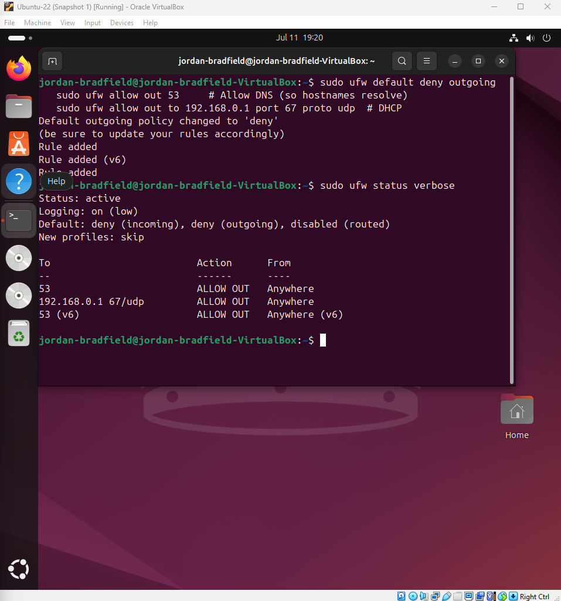
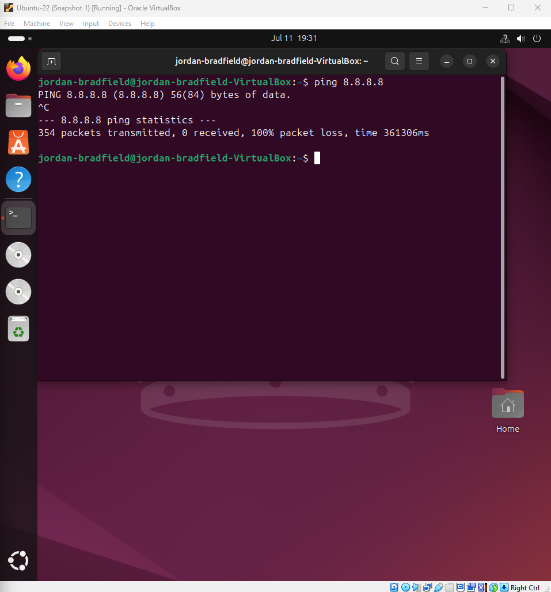
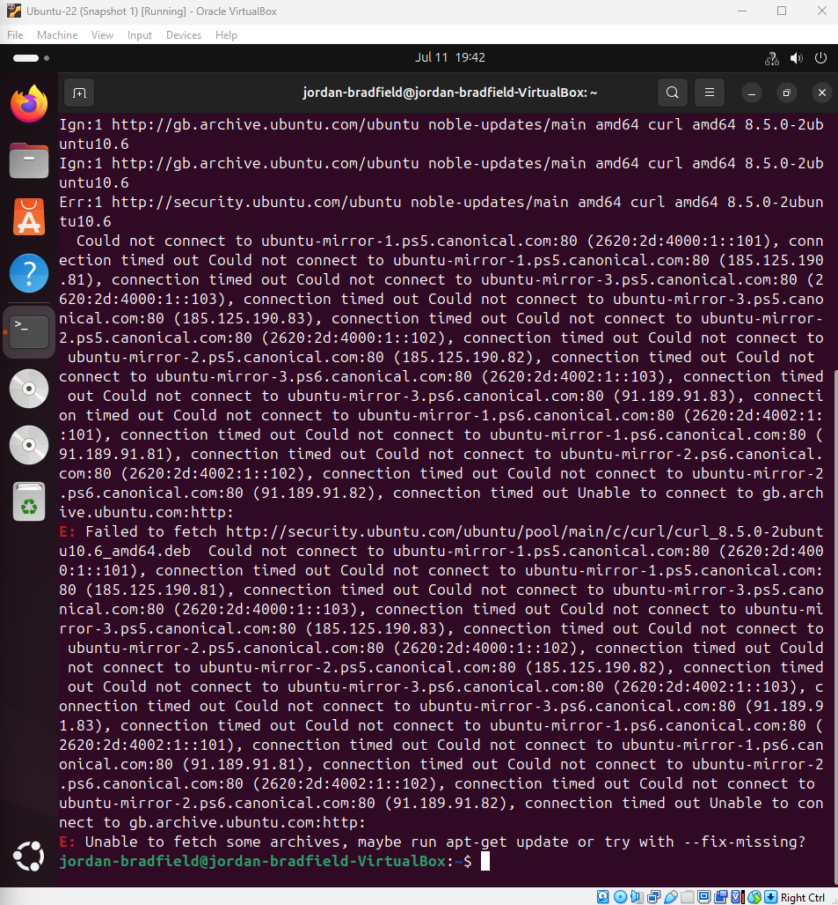

# Ticket 04 – Firewall Blocking Internet Access

## Ticket Source
- **Ticket ID:** 0004-FB
- **Date Reported:** 11-07-2025
- **Reported by:** Internal user "jordanb"
- **Received via:** Home Lab simulation

## Issue Summary
After applying new firewall rules using `ufw`, the VM no longer has access to the internet. Pings to external IPs fail and websites do not load. DNS appears functional, suggesting outbound HTTP/S is being blocked.

## Environment
- Ubuntu 22.04 LTS VM
- UFW (Uncomplicated Firewall) enabled
- VirtualBox (NAT networking)
- Internet connectivity tested via `ping` and `curl`

## Notes / Terminology

- **sudo:** Runs commands with administrative privileges.
- **ufw:** Uncomplicated Firewall, a tool to manage firewall rules easily.


## Recreate the Issue

To simulate a firewall misconfiguration, outbound internet traffic was intentionally blocked using `ufw`:

```bash
sudo ufw default deny outgoing
sudo ufw allow out 53
sudo ufw allow out to 192.168.0.1 port 67 proto udp
```

### Firewall status:



### Ping and Curl failure:

- `ping 8.8.8.8` fails with "Destination unreachable"
- `curl https://example.com` times out

  

---

### ❌ curl Installation Fails (Expected)

To further verify that outbound connections are blocked, we attempted to install `curl` using `apt`.

```bash
sudo apt install curl
```

The system fails to fetch packages from the Ubuntu mirrors due to the firewall denying HTTP/HTTPS traffic.

📸 **Screenshot:**  
APT error showing failed connections  


This demonstrates how strict firewall rules can interfere with system operations like package installation, a realistic scenario in locked down environments.

---

Having confirmed that essential tools like `ping`, `curl`, and even `apt install curl` are being blocked by the firewall, I moved on to investigate which outbound services were affected and isolate the root cause of the connectivity issue.

---


