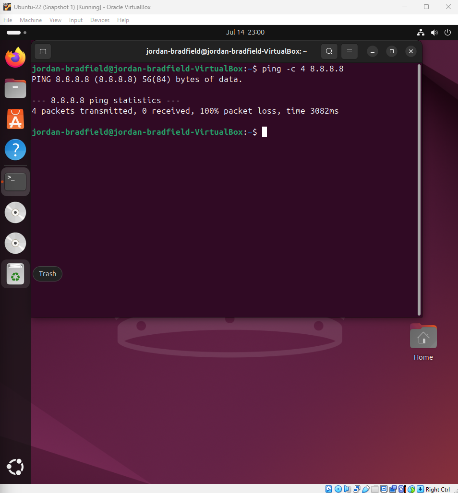
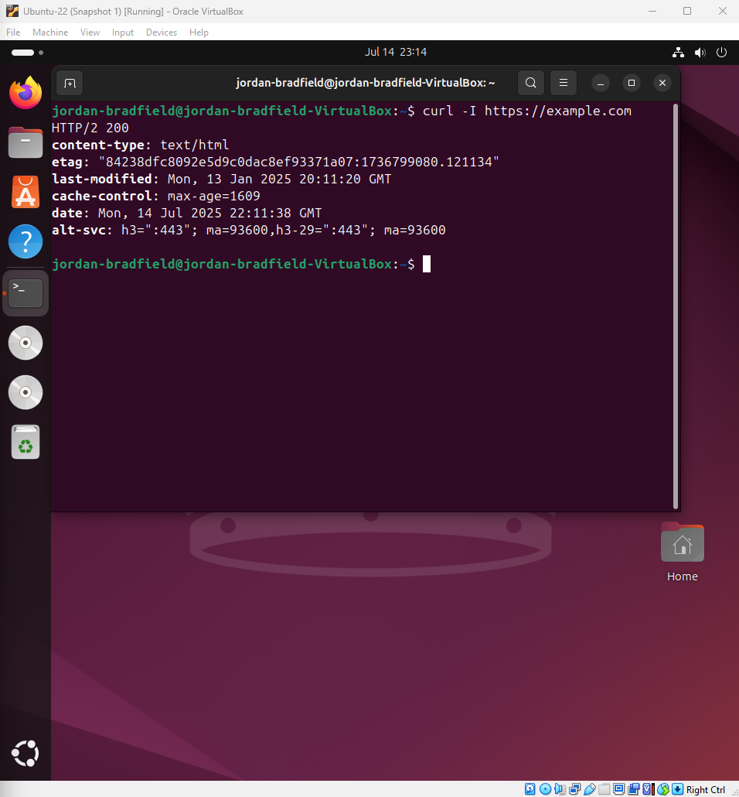
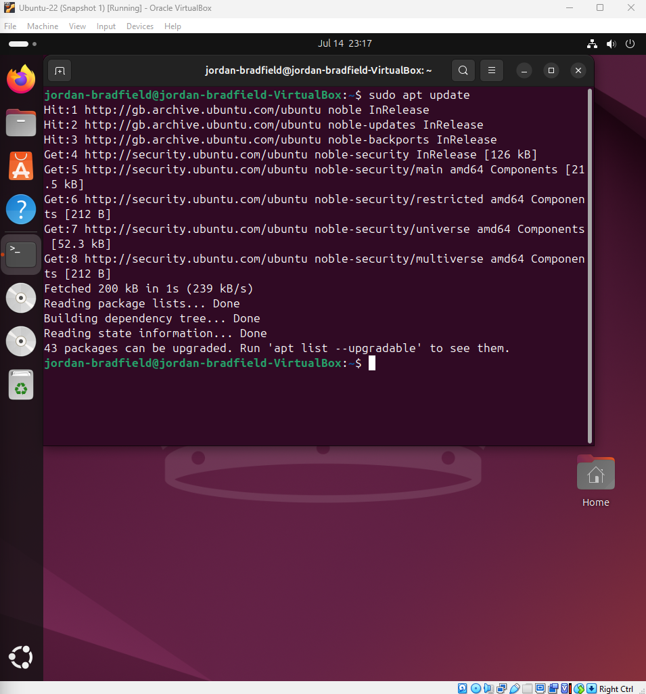
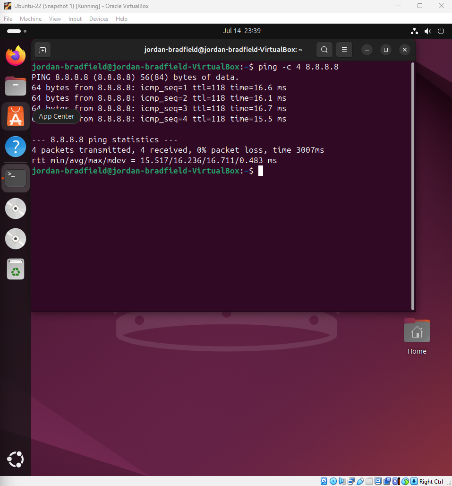

# Ticket 04 – Firewall Blocking Internet Access

## Ticket Source
- **Ticket ID:** 0004-FB
- **Date Reported:** 11-07-2025
- **Reported by:** Internal user "jordanb"
- **Received via:** Home Lab simulation

## Issue Summary
After applying new firewall rules using `ufw`, the VM no longer has access to the internet. Pings to external IPs fail and websites do not load. DNS appears functional, suggesting outbound HTTP/S is being blocked.

## Environment
- Ubuntu 22.04 LTS VM
- UFW (Uncomplicated Firewall) enabled
- VirtualBox (NAT networking)
- Internet connectivity tested via `ping` and `curl`

## Notes / Terminology

- **sudo:** Runs commands with administrative privileges.
- **ufw:** Uncomplicated Firewall, a tool to manage firewall rules easily.


## Recreate the Issue

To simulate a firewall misconfiguration, outbound internet traffic was intentionally blocked using `ufw`:

```bash
sudo ufw default deny outgoing
sudo ufw allow out 53
sudo ufw allow out to 192.168.0.1 port 67 proto udp
```

### Firewall status:


### Ping and Curl failure:

- `ping 8.8.8.8` fails with "Destination unreachable"
- `curl https://example.com` times out

  

---

### curl Installation Fails (Expected)

To further verify that outbound connections are blocked, we attempted to install `curl` using `apt`.

```bash
sudo apt install curl
```

The system fails to fetch packages from the Ubuntu mirrors due to the firewall denying HTTP/HTTPS traffic.

📸 **Screenshot:**  
APT error showing failed connections  


This demonstrates how strict firewall rules can interfere with system operations like package installation, a realistic scenario in locked down environments.

---

Having confirmed that essential tools like `ping`, `curl`, and even `apt install curl` are being blocked by the firewall, I moved on to investigate which outbound services were affected and isolate the root cause of the connectivity issue.

---

## Investigate & Isolate the Problem

With internet access unavailable and the cause suspected to be firewall related, the next step is to investigate and isolate the source of the issue.

### 1. Confirm DNS Resolution Works

Since outbound DNS (port 53) was explicitly allowed, we tested name resolution:

```bash
nslookup google.com
```

 This command successfully returned IP addresses, confirming that DNS queries are permitted through the firewall.

📸 **Screenshot:**  
DNS response from `nslookup`  


---

### 2. Review Current UFW Rules

To verify the firewall is still enforcing the intended restrictions, I re-checked UFW’s verbose status:

```bash
sudo ufw status verbose
```

Output confirms:
- Default outgoing policy is set to **deny**
- Only DNS (port 53) and DHCP (port 67) are allowed outbound

📸 **Screenshot:**  
UFW rule verification  


---

### Isolation Summary

- DNS queries resolve successfully → DNS is allowed  
- APT and ping fail → HTTP, HTTPS, and ICMP are blocked  
- Firewall is configured correctly to simulate this failure

This confirms that **outbound restrictions in UFW are the root cause**, and the environment is correctly simulating a firewall blocking internet access.

---

## Restore Outbound Web Access

To fix the firewall misconfiguration, I explicitly allowed outbound HTTP and HTTPS traffic using the following commands:

```bash
sudo ufw allow out 80/tcp     # Allow HTTP
sudo ufw allow out 443/tcp    # Allow HTTPS
```

These rules modify the firewall to permit web traffic, enabling functions like:

- Downloading packages via `apt`
- Accessing websites in a browser
- Using tools like `curl` and `wget`

📸 **Screenshots:**

| Description                            | Image                                |
|--------------------------------------|-------------------------------------|
| After running `sudo ufw allow out 80` |  |
| After running `sudo ufw allow out 443`| |

---

## Verify Restored Internet Access (Test Fails)

### 1. Test Ping to External IP

I ran the following command to verify internet connectivity:

```bash
ping -c 4 8.8.8.8
```

However, the ping failed with 100% packet loss, indicating internet access is still blocked.

📸 Screenshots:

| Description                       | Image                              |
|---------------------------------|----------------------------------|
| Full output of failed ping command |   |

---

## Verify HTTP(S) and Apt Access (Test Success)

### 1. Test Curl to a Website

I ran the following command to verify HTTP(S) connectivity:

```bash
curl -I https://example.com
```

The command succeeded, returning HTTP status 200 and response headers, confirming outbound HTTP/HTTPS traffic is functional.

📸 **Screenshots:**

| Description                       | Image                           |
| --------------------------------- | ------------------------------- |
| Full output of successful curl    |    |

---

### 2. Test Apt Package Update

I ran the package update command to check repository access:

```bash
sudo apt update
```

This command succeeded, showing successful fetches from the package repositories.

📸 **Screenshots:**

| Description                      | Image                           |
| -------------------------------- | ------------------------------- |
| Full output of successful apt update |  |

---

## Test Real-World Internet Usage & Final Validation

### 1. Install Curl Package

To confirm package installation works, I ran:

```bash
sudo apt install curl -y
```

📸 **Screenshots:**

| Description                       | Image                        |
| --------------------------------- | ---------------------------- |
| Full installation process         |     |

---

### 2. Curl Web Request

To verify HTTP access, I fetched headers from a website:

```bash
curl -I https://example.com
```

📸 **Screenshots:**

| Description                   | Image                      |
| ----------------------------- | -------------------------- |
| Full curl command output      |    |

---

### 3.  IPv4 Ping Test

To confirm stable internet connectivity, I ran:

```bash
ping -c 4 8.8.8.8
```

📸 **Screenshots:**

| Description                     | Image                      |
| ------------------------------- | -------------------------- |
| Full ping command output        |        |

---

### 3.  IPv6 Ping Test

To confirm stable internet connectivity, I ran:

```bash
ping6 -c 4 google.com
```

📸 **Screenshots:**

| Description                     | Image                      |
| ------------------------------- | -------------------------- |
| Full ping IPv6 command output    |        |


