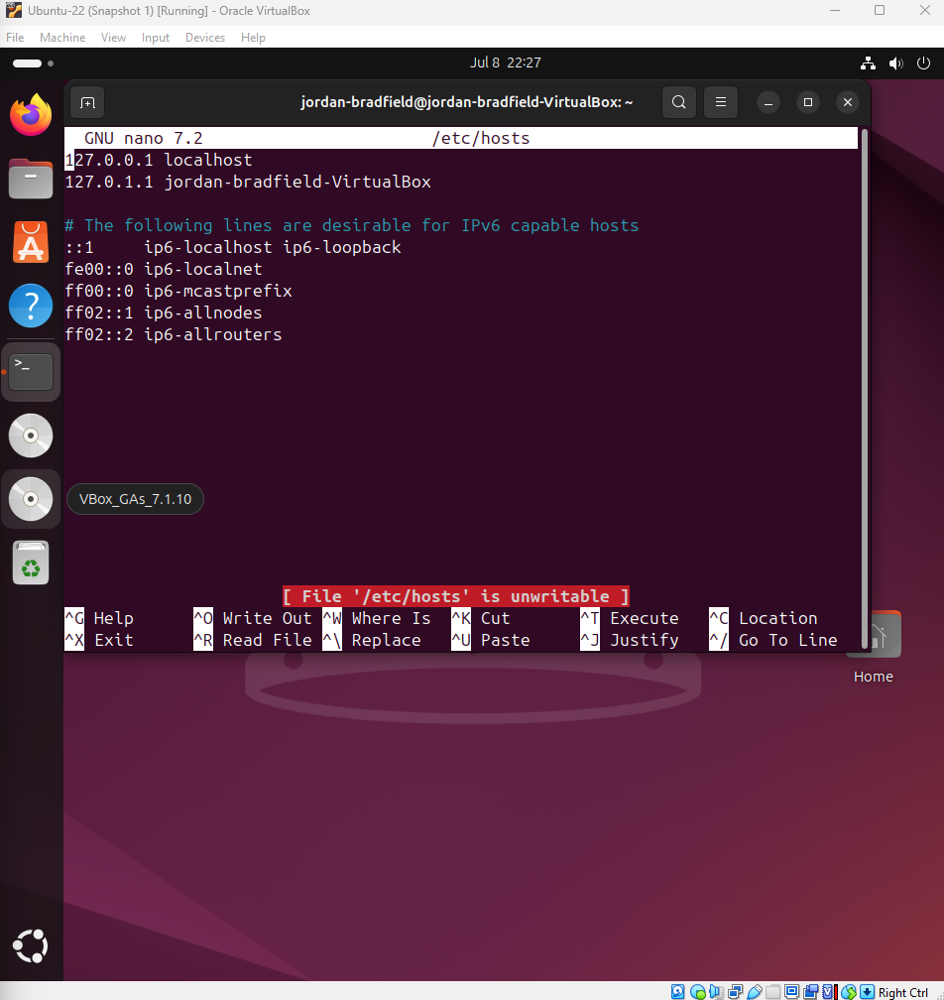
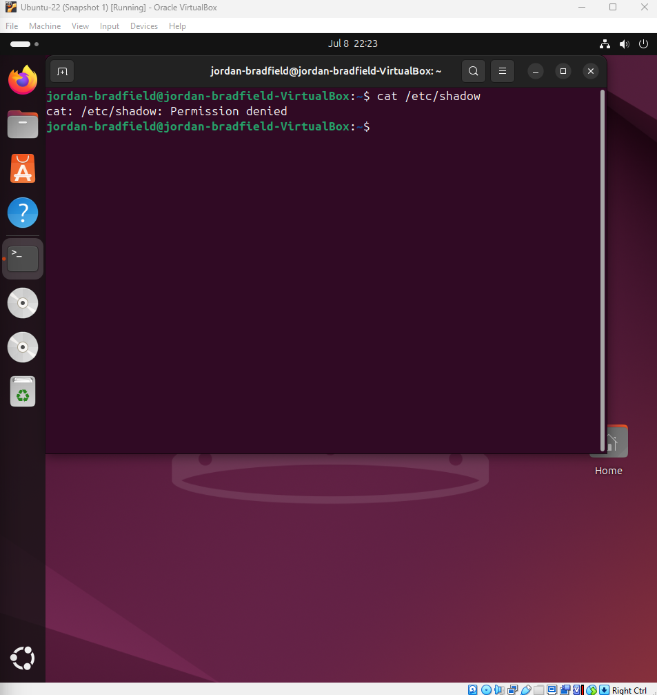
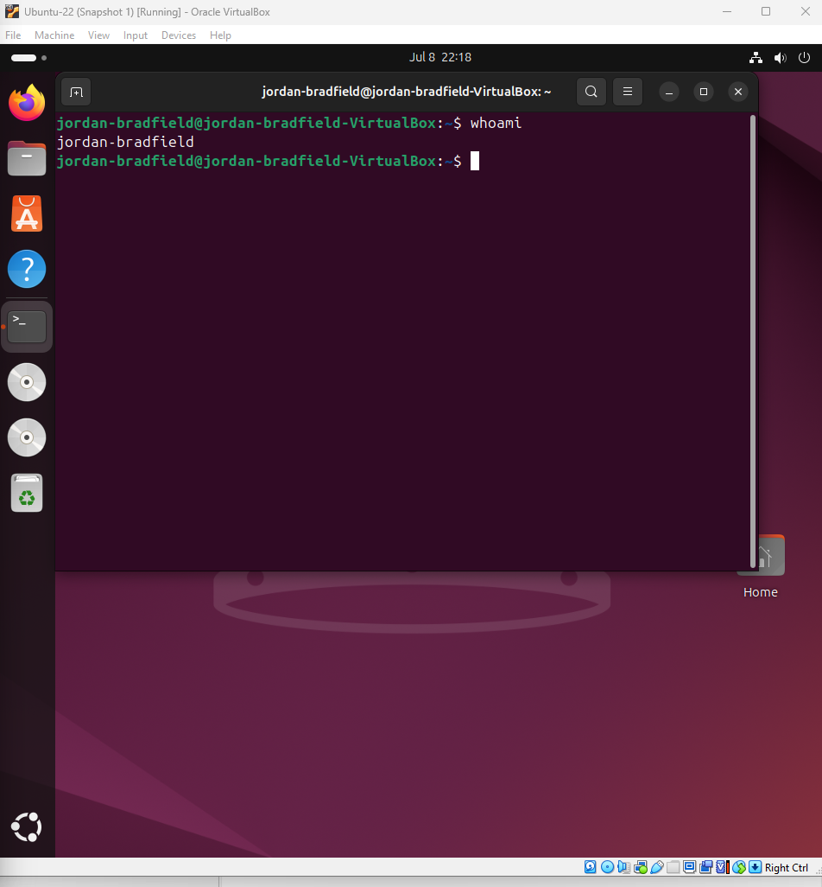
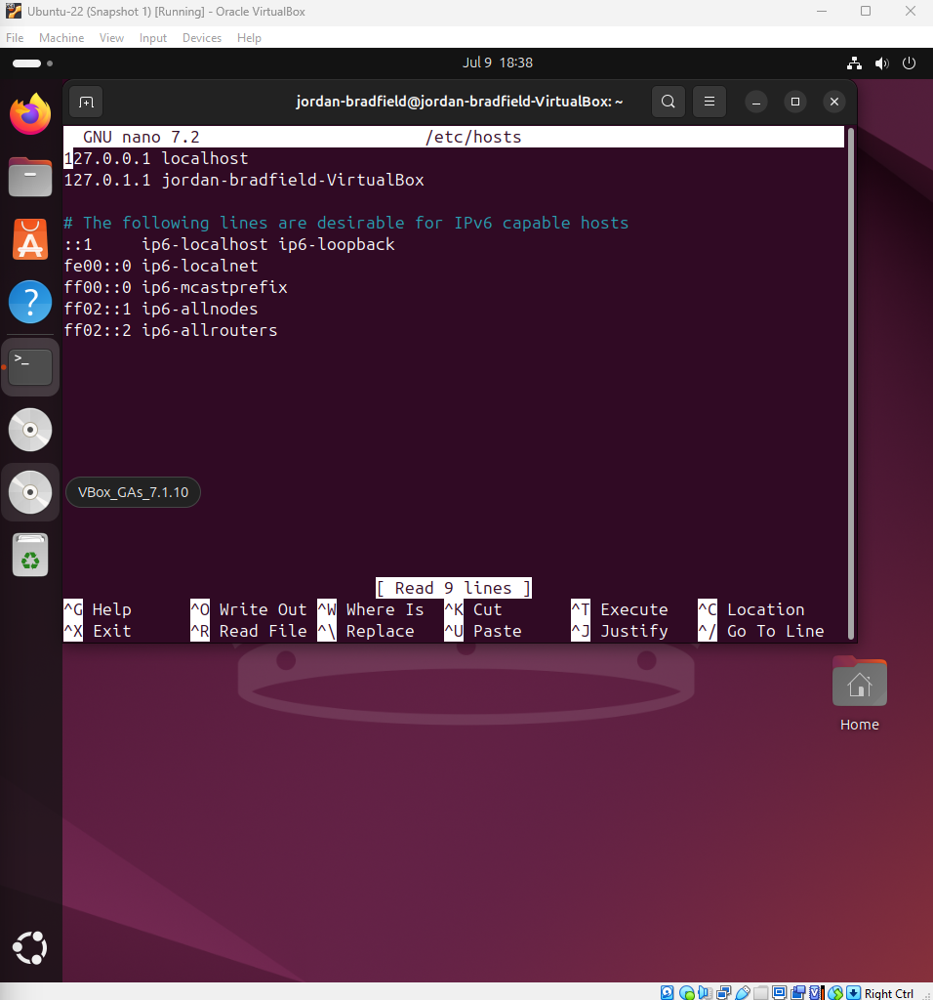
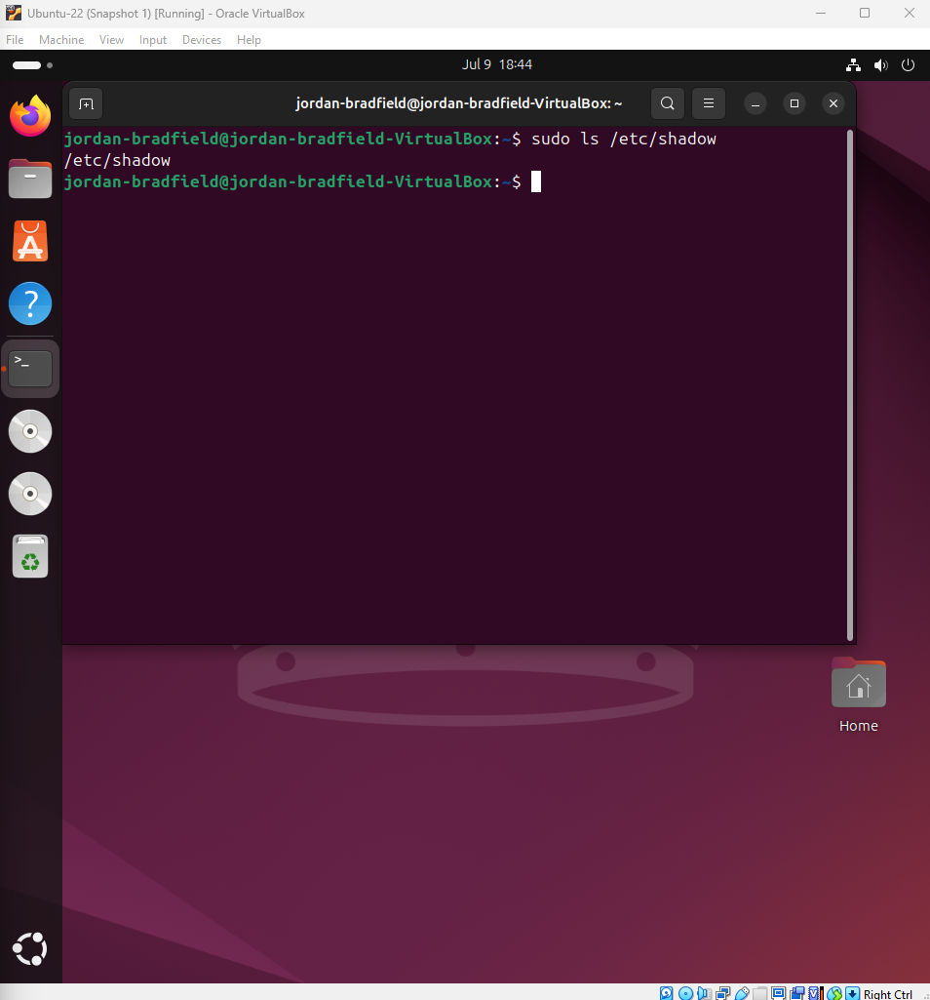

# Ticket 05 – User Permission Error

## Ticket Source
- **Ticket ID:** 0005-UPE (User Permission Error)
- **Date Reported:** 08-07-2025
- **Time Reported:** 10:42 BST
- **Reported by:** Internal user "jordanb"
- **Received via:** Internal IT support request

## Issue Summary
A user reported they could not perform administrative actions such as modifying system files or viewing protected directories on the Ubuntu VM. The user appears to lack the necessary permissions, suggesting this may be due to running actions under a non-root user account.

## Environment
- **VirtualBox Version:** 7.1.6
- **Guest OS:** Ubuntu 22.04 LTS
- **Host OS:** Windows 11
- **VM User Account:** `jordan-bradfield` (non-root)

---

## 🛠 Recreate the Issue

To reproduce the problem, the following steps were carried out:

1. **Logged into the Ubuntu VM** as the regular user `jordan-bradfield`.
2. Attempted to **edit a protected system file** without `sudo`:
   ```bash
   nano /etc/hosts
   ```
   - Result: Nano opened the file but displayed a warning indicating it was **unwritable**.

   

3. Attempted to **view the `/etc/shadow` file**, which is restricted:
   ```bash
   cat /etc/shadow
   ```
   - Result: **Permission denied**, confirming lack of root access.

   

4. Confirmed the session was under the **regular user account**:
   ```bash
   whoami
   ```
   - Output: `jordan-bradfield`

   

5. Used `sudo` to confirm the user **can escalate privileges** with the correct password:
   ```bash
   sudo ls
   ```
   - Output: Directory contents were listed successfully.

   

---

> These tests confirm that the user does not have elevated permissions by default but can access them using `sudo`.

The next step is to verify group memberships, review sudo permissions, and consider hardening user policies.

## Investigate & Isolate the Problem

To diagnose the permission denied errors experienced by the regular user, the following steps were performed:

### 1. Check User Group Memberships

Run the `groups` command to see which groups the user belongs to, verifying whether they are part of the `sudo` group:

```bash
groups
```

📸 Screenshot: 

---

### 2. Verify File Permissions

List permissions of critical system files that the user tried to access but received errors on, such as `/etc/hosts` and `/etc/shadow`:

```bash
ls -l /etc/hosts
ls -l /etc/shadow
```

📸 Screenshots:  
-  (nano editing `/etc/hosts`)  
-  (permission denied on `/etc/shadow`)

---

### 3. Review Sudoers Configuration

Check the contents of the sudoers file to confirm which users and groups have sudo privileges:

```bash
sudo cat /etc/sudoers
```

📸 Screenshot: 

Validate sudoers file syntax with:

```bash
sudo visudo -c
```

---

### Findings

- The regular user is **not** a member of the `sudo` group and therefore lacks sudo privileges.
- Permissions on critical files like `/etc/hosts` prevent modification by non-privileged users.
- Sudo privileges must be granted by adding the user to the appropriate group (`sudo`).

## Verification

After applying the necessary fix, I verified that the user `jordan-bradfield` could now successfully perform previously denied actions using `sudo`.

### Retested Denied Command

Previously, the user received a `[ File '/etc/hosts' is unwritable ]` error when trying to open `/etc/hosts` using `nano`.

```bash
nano /etc/hosts
```

After using `sudo`, the file was successfully opened in write mode:

```bash
sudo nano /etc/hosts
```

| Description                         | Image                                       |
|-------------------------------------|---------------------------------------------|
| `sudo nano /etc/hosts` success      |     |

---

### Validated System File Access

The user could now also access protected files such as `/etc/shadow`:

```bash
sudo ls /etc/shadow
```

| Description                         | Image                                        |
|-------------------------------------|----------------------------------------------|
| `sudo ls /etc/shadow` success       |     |

---

### Group Membership Confirmation

To ensure the user had correct permissions, I checked group memberships:

```bash
groups
```

| Description               | Image                                 |
|---------------------------|----------------------------------------|
| Verified user groups      |  |

No unnecessary group memberships were found, and `sudo` was present.

---

### Security Check & Fix Summary

No unintended permission escalations were observed. The user was added to the `sudo` group using:

```bash
sudo usermod -aG sudo jordan-bradfield
```

No direct changes were made to `/etc/sudoers`. The default sudo policy (managed via group `sudo`) applied correctly.

---


