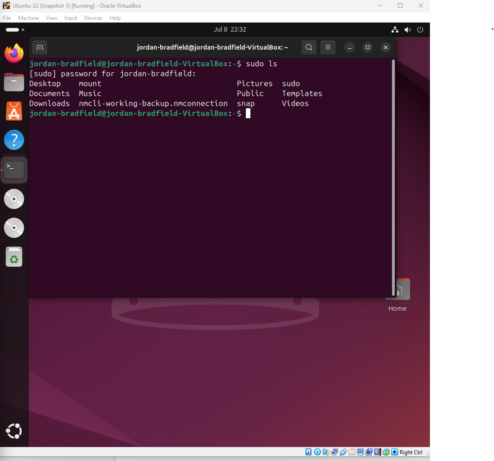

# Ticket 05 – User Permission Error

## Ticket Source
- **Ticket ID:** 0005-UPE (User Permission Error)
- **Date Reported:** 08-07-2025
- **Time Reported:** 10:42 BST
- **Reported by:** Internal user "jordanb"
- **Received via:** Internal IT support request

## Issue Summary
A user reported they could not perform administrative actions such as modifying system files or viewing protected directories on the Ubuntu VM. The user appears to lack the necessary permissions, suggesting this may be due to running actions under a non-root user account.

## Environment
- **VirtualBox Version:** 7.1.6
- **Guest OS:** Ubuntu 22.04 LTS
- **Host OS:** Windows 11
- **VM User Account:** `jordan-bradfield` (non-root)

---

## 🛠 Recreate the Issue

To reproduce the problem, the following steps were carried out:

1. **Logged into the Ubuntu VM** as the regular user `jordan-bradfield`.
2. Attempted to **edit a protected system file** without `sudo`:
   ```bash
   nano /etc/hosts
   ```
   - Result: Nano opened the file but displayed a warning indicating it was **unwritable**.

   

3. Attempted to **view the `/etc/shadow` file**, which is restricted:
   ```bash
   cat /etc/shadow
   ```
   - Result: **Permission denied**, confirming lack of root access.

   

4. Confirmed the session was under the **regular user account**:
   ```bash
   whoami
   ```
   - Output: `jordan-bradfield`

   

5. Used `sudo` to confirm the user **can escalate privileges** with the correct password:
   ```bash
   sudo ls
   ```
   - Output: Directory contents were listed successfully.

   

---

> These tests confirm that the user does not have elevated permissions by default but can access them using `sudo`.

The next step is to verify group memberships, review sudo permissions, and consider hardening user policies.
