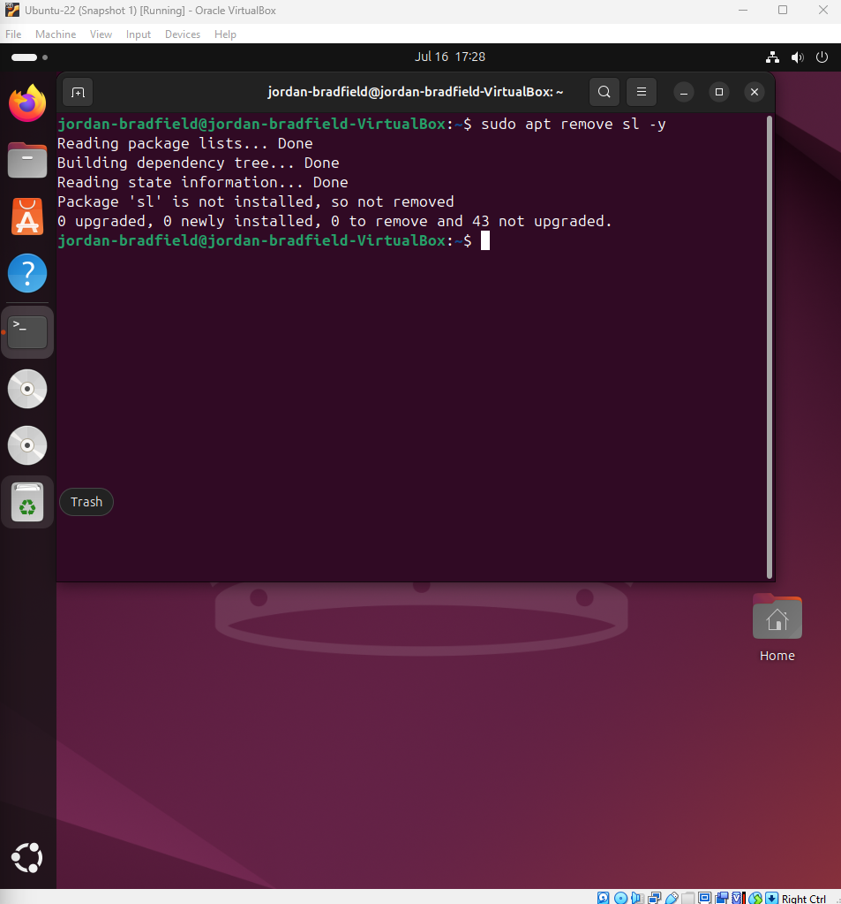
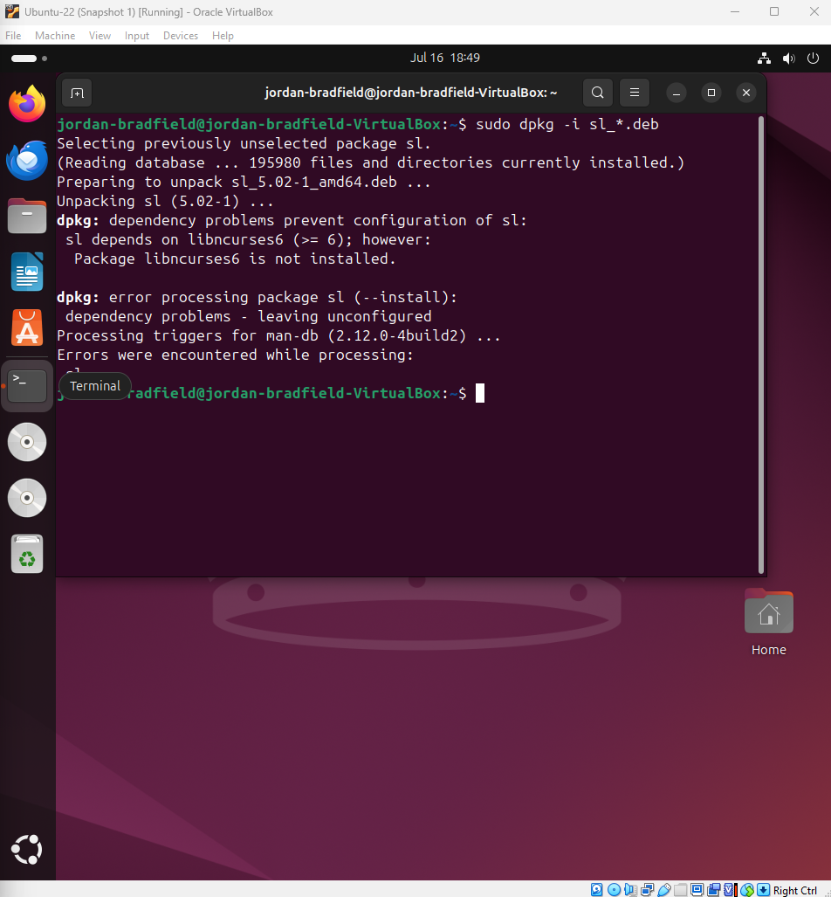

# Ticket 06 – Package Install Fails Due to Missing Dependency

## Ticket Source
- **Ticket ID:** 0006-PIF
- **Date Reported:** 16-07-2025
- **Time Reported:** 20:05 BST
- **Reported by:** Internal user "jordanb"
- **Received via:** Home Lab simulation

## Issue Summary
During an attempt to install a simple package (`sl`), the install fails due to missing dependencies. This simulates a common issue where packages break or dependency chains are broken.

## Environment
- **Guest OS:** Ubuntu 22.04 LTS
- **Package Tool:** `dpkg` used instead of `apt`
- **Networking:** Working
- **User Account:** jordan-bradfield (non-root)

---

## 🔧 Break the System Intentionally

To simulate a realistic package installation failure, I deliberately bypassed dependency handling by using `dpkg` to install the `sl` package manually.

### 1. Remove any existing version of `sl`

```bash
sudo apt remove sl -y
```

📸 **Screenshots:**

| Description                    | Image                             |
|-------------------------------|------------------------------------|
| Output after removing `sl`     |  |

---

### 2. Download the `.deb` file manually

```bash
apt download sl
```

📸 **Screenshots:**

| Description                      | Image                              |
|----------------------------------|------------------------------------|
| `.deb` package download output   |  |

---

### 3. Install with `dpkg` (without dependencies)

```bash
sudo dpkg -i sl_*.deb
```

This command fails with a **dependency error**, as `dpkg` does not resolve dependencies automatically.

📸 **Screenshots:**

| Description                         | Image                                  |
|-------------------------------------|----------------------------------------|
| Failed install with dependency error|  |

---

### (Optional) Repair the System

```bash
sudo apt install -f
```

📸 **Screenshots:**

| Description                          | Image                                |
|--------------------------------------|--------------------------------------|
| Output showing dependencies being fixed |  |

